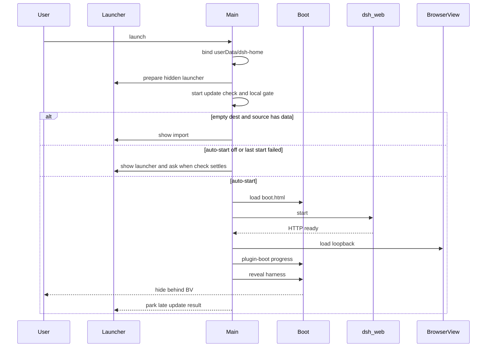

# 流程：冷启动到就绪

## 步骤

1. 用户启动应用（安装包或 `npm start`）。单实例锁：已有实例则聚焦已有窗口。
2. `whenReady` 绑定桌面 `$DSH_HOME` 为 `userData/dsh-home` 并建目录（不读 `~/.dsh`，见 [../modules/dsh-home.md](../modules/dsh-home.md)）；注册 IPC / 菜单 / 托盘；预创建隐藏的启动器窗（preload 角色 **launcher**）。
3. `launcher-gate.runColdStartGate` 并行发起 GitHub `/releases/latest` 检查与本地判定。自动启动已开启、没有导入 hold 或上次失败时，立即启动桌面，不等待网络结果。迟到更新只保存并提示，不打开启动器；用户下次真正打开启动器时才询问。
4. 关闭自动启动、待导入或上次失败时先显示启动器。新正式版只在可见启动器询问，确认后安装该次展示的 release；下载或校验失败留在启动器首页。自动启动失败也显示启动器，并在检查结果到达后消费更新提示。
5. 桌面启动走主窗 boot 页（`src/renderer/boot.html`，preload **boot**）：`HarnessController.start()` 起 `dsh web`、订端口、准备 BrowserView。插件进度留在 boot 画布，不切官方加载页。
6. 插件装完且就绪：main 露出 BrowserView（官方四栏 UI）；preload 角色为 **harness**。若「启动后退出启动器」为开，关启动器窗。
7. 桌面起不来或插件树失败：**不关**启动器，切到插件问诊。托盘 / 文件菜单「打开启动器」可随时再 `show()`。

## 门槛

- QA：`TC-LAUNCH-001` … `TC-LAUNCH-008`（冷启动闸门 / 导入拦截 / 失败留下启动器 / 官方浅色深色 / 更新下载失败留在启动器）
- QA：`TC-INST-001` … `TC-INST-004`，`TC-INST-003`（插件进度留在启动页），`TC-INST-011`（官方 `~/.dsh` 不能拖死桌面）

## 入口

- `src/main/index.js`、`launcher-gate.js`、`window.js`、`harness-controller.js`、`dsh.js`、`src/shared/dsh-home.js`
- `src/renderer/launcher.js`、`boot.js`、`boot-recovery.js`
