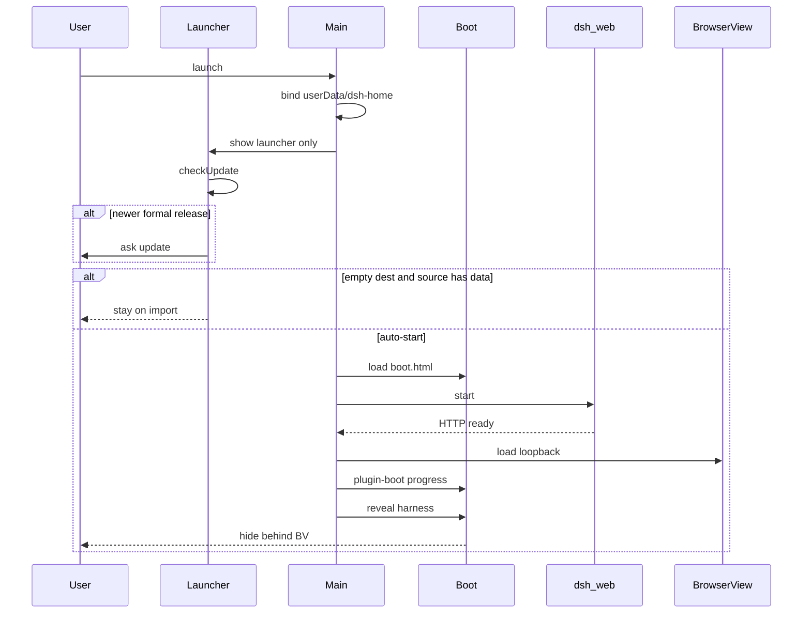

# 流程：冷启动到就绪

## 步骤

1. 用户启动应用（安装包或 `npm start`）。单实例锁：已有实例则聚焦已有窗口。
2. `whenReady` 绑定桌面 `$DSH_HOME` 为 `userData/dsh-home` 并建目录（不读 `~/.dsh`，见 [../modules/dsh-home.md](../modules/dsh-home.md)）；注册 IPC / 菜单 / 托盘；**只开启动器窗**（preload 角色 **launcher**）。禁止无条件 `HarnessController.start()`。
3. 启动器立刻 `checkUpdate()`（GitHub `/releases/latest`，draft 不会出现）。有新正式版则先 `openLauncher()` 再询问是否更新（弹框/下载进度都在可见启动器上）：是 → `installUpdate()`，失败或未真正拉起安装器时回启动器首页提示、该轮不自动进桌面；否 → 当作本次跳过。检查失败不拦，启动器里留一行弱提示。编排见 `launcher-gate.runColdStartGate`。
4. 随后自动启动桌面端，除非：桌面 `sessions/` 为空且 `~/.dsh` 有可导入数据 → 停在「导入」，不自动启。上次桌面启动失败则切到「插件问诊」。
5. 桌面启动走主窗 boot 页（`src/renderer/boot.html`，preload **boot**）：`HarnessController.start()` 起 `dsh web`、订端口、准备 BrowserView。插件进度留在 boot 画布，不切官方加载页。
6. 插件装完且就绪：main 露出 BrowserView（官方四栏 UI）；preload 角色为 **harness**。若「启动后退出启动器」为开，关启动器窗。
7. 桌面起不来或插件树失败：**不关**启动器，切到插件问诊。托盘 / 文件菜单「打开启动器」可随时再 `show()`。

## 门槛

- QA：`TC-LAUNCH-001` … `TC-LAUNCH-008`（冷启动闸门 / 导入拦截 / 失败留下启动器 / 官方浅色深色 / 更新下载失败留在启动器）
- QA：`TC-INST-001` … `TC-INST-004`，`TC-INST-003`（插件进度留在启动页），`TC-INST-011`（官方 `~/.dsh` 不能拖死桌面）

## 入口

- `src/main/index.js`、`launcher-gate.js`、`window.js`、`harness-controller.js`、`dsh.js`、`src/shared/dsh-home.js`
- `src/renderer/launcher.js`、`boot.js`、`boot-recovery.js`
