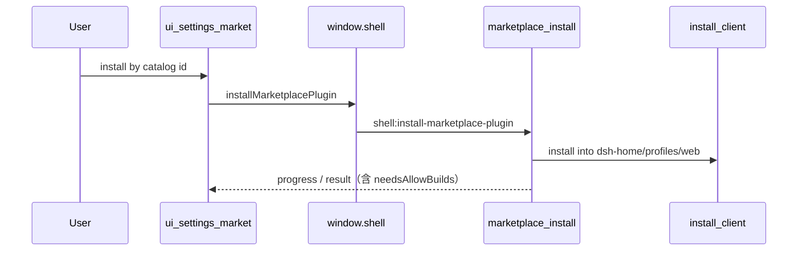

# 流程：市场安装插件

## 步骤

1. 用户打开设置 → **市场**（section id `market`，由桌面自有包 `ui-settings-market` 注册）。无独立 Electron 市场窗；`openMarketplace` 在 Harness 就绪后跳到该 section。
2. 浏览 / 搜索 / 分类过滤，刷新目录（`listMarketplace` / `refresh`）。
3. 按 catalog id 安装（`installMarketplacePlugin`）；进度经 `onPluginProgress` 流入分区内进度日志。
4. 安装走桌面 IPC → main `marketplace-install.js` / Host 安装客户端，落点 `userData/dsh-home/profiles/web`（不是 `~/.dsh`）；失败以 `role="alert"` 呈现，不静默吞。`needsAllowBuilds` 时分区内确认 allowBuilds key 后重试。
5. 成功后主进程 `restartAfterProfileWrite` 重启 Harness（HarnessController 所有）。
6. 卸载：`uninstallPlugin`；与「装完在 Composer 里塞草稿」的旧路径无关。

## 更新步骤

1. 分区加载已安装列表后调用 `checkMarketplaceUpdates`；手动刷新目录时强制重查。
2. npm 行读取实际安装版本并与 registry `latest` 做前向 semver 比较；GitHub 行读取 lockfile
   commit 并与远端 HEAD 比较。无法证明目标更高 / 不同则不显示更新入口；远端查询失败
   进入检查失败状态，不显示“全部最新”。
3. 用户按 catalog id 调用 `updateMarketplacePlugin`。主进程固定目标版本 / commit，快照 profile
   manifest、lockfile 与承载 allowBuilds 的 workspace 文件，再执行 `dsh plugin --profile web add <target>`。
4. CLI 失败、目标未变化、入口不可加载或 loader id 冲突时恢复快照并运行 profile install；
   UI 在错误行报告回滚成功或失败。成功后由 `restartAfterProfileWrite` 重启 Harness。

## 门槛

- QA：`TC-EXT-001` … `TC-EXT-005`
- Feature card：`marketplace-settings`（[../features/marketplace-settings.md](../features/marketplace-settings.md)）

## 入口

- Main：`marketplace-install.js`、`marketplace-catalog.js`、`dshmarket-preset.js`（仅残留清理）、`desktop-install-control.js`
- UI：`vendor/deepseek-harness/packages/client/ui-settings-market` → settings section `market`
