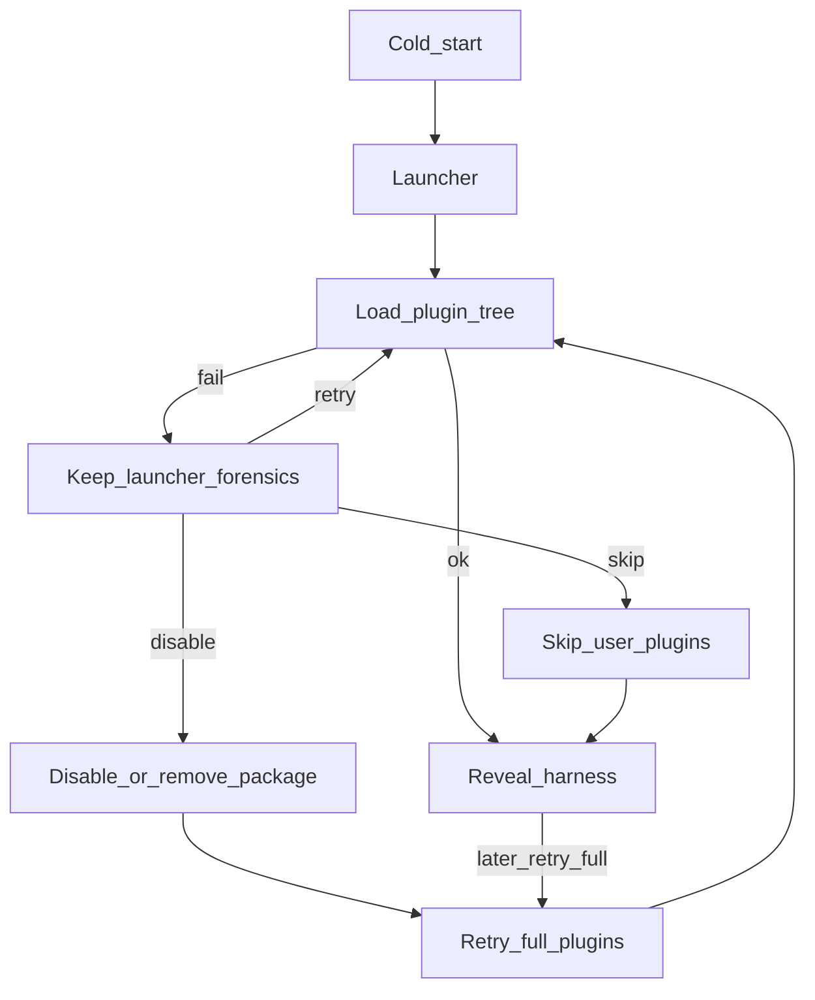

# 流程：插件启动恢复

## 步骤

1. 冷启动装用户插件树时失败（造障或真实坏插件）。启动器**不关**，切到「插件问诊」。
2. 问诊不启内核：列出 `profiles/web` 已装包；从上次 boot 日志抽出嫌疑包名。对得上的行标「可能导致本次失败」。OOM / 端口占用 / 缺 Node 只显示分类原因，不谎称某个插件。
3. 用户可禁用（从 bundles 去掉，写入壳层 `disabledPlugins`）或删除（`dsh plugin remove`，仅桌面 home）。桌面预置 `dsh-usage-panel` 不允许删除。
4. 「再试桌面端」先清 sticky skip，再全插件启动。问诊删/禁完之前，仍可「先跳过用户插件启动」进桌面（sticky `--skip-user-plugins` 保留）。
5. 跳过成功后进入主界面（功能可能缺用户插件）；可再调「再试完整插件」`retryFullPlugins`。
6. Harness 运行中崩溃：可回故障页 + 自动重启倒计时；用户可取消倒计时。
7. boot 页（主窗）失败面只有瞬时动作：重试 / 取消自动重启 / 下载日志，外加「回启动器排查」跳板（`shell:open-launcher` BOOT 角色 → 启动器 home tab 的 Recovery Board）。插件级恢复（归因、逐项/批量禁用、skip）只在 Recovery Board 一处。

## 门槛

- QA：`TC-LAUNCH-005`、`TC-INST-004` … `TC-INST-007`
- Feature card：`desktop-launcher`（问诊）+ `boot-page`（启动画布与跳过入口）

## 入口

- `plugin-forensics.js`、`plugins.js`（`applyDisabledBundles`）、`harness-controller.js`、`plugin-tree-failure.js`、`plugin-recovery-actions.js`
- `src/renderer/launcher.js`、`src/renderer/boot-recovery.js`
