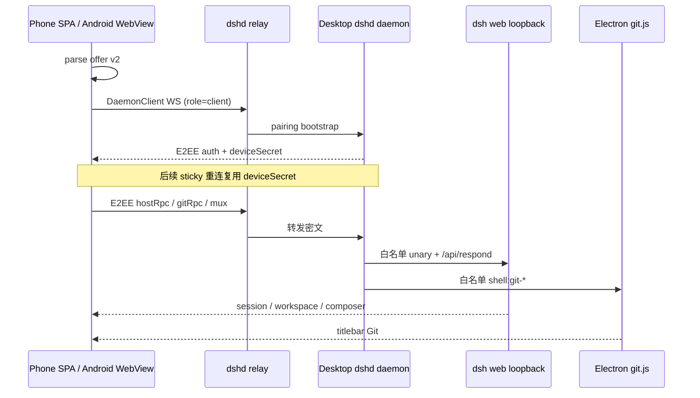

# 流程：手机远程配对

**当前停放：** 桌面不露出设置「远程」与侧栏扫码。下列是解禁后的步骤。

## 步骤

1. 设置 → 远程 → 网关选择局域网或外出；侧栏底部手机图标打开配对弹窗并开启远程。两种模式的协议相同，传输都经过配置的 dshd 中继。
2. 桌面生成包含 dshd offer 的 `#offer=` 二维码，包装纸按模式不同：
   - **局域网**：`appBaseUrl` = `preferredLanIp():3180`，本机 `mobile/web` SPA。
   - **外出**：`appBaseUrl` = `DEFAULT_PUBLIC_APP_BASE_URL`（公网 nginx `http://125.124.85.212:3389/dshd/`；`:80` 已部署但安全组未放行），系统相机打开浏览器公网页；App 内扫走 APK 内置 SPA（`appassets.androidplatform.net`），不加载公网 origin。
   中继地址只在 offer 内用作传输端点（`:8411`），不充当页面地址。配对链接为 HTTP 明文，MITM 可读 `#offer=` hash。sticky 三 origin（公网 `/dshd`、LAN `:3180`、`appassets.androidplatform.net`）不互通。
3. 浏览器用系统相机、SPA 内扫码或粘贴完整链接；Android 原生扫码/粘贴后由 APK 内的同一份 SPA 在 `https://appassets.androidplatform.net` WebView origin 打开 offer。
4. SPA 用 `parseConnectionOfferFromUrl` 校验 offer，创建 `DaemonClient`，以 `role=client` 连中继，并用桌面 daemon 公钥建立端到端加密会话。首次配对用短期 pairing token 换取 `deviceSecret`；后续从稳定 origin 的 localStorage sticky 重连。
5. 配对之后 SPA 是正在跑的 `dsh web` 第二客户端。ChisaCode 只负责配对 / E2EE / sticky。之后两条已配对通道：host RPC（白名单 unary + `respond`）进 loopback `dsh web`；Git 进 Electron `git.js`。禁止 `fetchAgents` / `createAgent`。Harness 未就绪时抽屉明示「桌面端未启动」。
6. 抽屉对齐桌面侧栏：`session.list` + `workspace.list`（隐藏 blank 与 `origin:'dshbot'`）；按工作区分组 / 一个列表；搜索 `session.search`（snippet）；行 ⋯ 重命名 / Fork / 上移下移 / 归档（活会话无删除）；已归档取消归档或 `session.delete`；子智能体只读。
7. 新会话：已有工作区、无工作区文件夹、浏览本机（`host.listDirectory` / `createDirectory` / `workspace.create` / `session.create`）。禁止 `host.pickDirectory`。
8. Composer：`session.models` / `session.selectModel`（含 reasoningEffort）；权限与 Plan / 斜杠走 Typert `commands/execute`；发送 `session.prompt`、停止 `session.cancel`；审批 `respond` → `POST /api/respond`。
9. 顶栏 Git 对齐 `git-titlebar`：Init、分支搜索/切换/创建并检出、stacked Commit & push / Publish / View PR。执行走 `dshd.git.rpc` → `shell:git-*`。不转发 stage / pty / writeFile。
10. 时间线：`session.history`（`beforeSeq`）+ mux 或 1.5s 轮询。daemon mux 不转发 `assistant/chunk`（避免堵审批帧）。断线横幅 + 草稿；重连后 `session.list` + 当前 `history`。Files / Diff / MCP / 技能显示冻结条，不装做成空列表。
11. offer 无效、重连、会话目录、创建会话、Git 和桌面专属操作失败都必须显示在连接错误、banner 或 toast。
12. 手机侧复用官方语义色（`--dsw-alias-*`），不嵌官方插件树，不用启动页 `--boot-*`。

## 门槛

- 自动门槛：`node --test "mobile/web/**/*.test.js"`、`src/shared/dshd-host-tunnel.test.js`、`src/main/dshd-git-dispatch.test.js`、`src/main/chisacode-remote.test.js`。
- 浏览器集成：`node tools/mobile-web-qa/run-qa.mjs`（fake **host** 会话 + 真实 SPA 栈，需 `npm i --no-save puppeteer-core` 与本机 Chrome）。
- Android：有 SDK 时运行 `mobile/android/gradlew test` 与 `assembleDebug`。配对后 WebView 功能集必须与公网 SPA 相同。
- 真机门（本轮 Web）：[docs/qa/mobile-remote-live-acceptance.md](../../qa/mobile-remote-live-acceptance.md) T1。T3 Android Deferred。缺一条 P0、或列表 `D ≠ P`、或用非法证据顶替，都不算完成。

## 入口

- `src/main/chisacode-remote.js`、`src/main/dshd-daemon-hooks.mjs`、`src/main/dshd-git-dispatch.js`、`src/shared/dshd-host-tunnel.js`、`src/main/mobile-web-server.js`
- `mobile/web/host/`（backend / catalog / history / models / mux / freeze）、`mobile/web/app.js`、`mobile/web/git/`
- `mobile/web/chisacode/session.js`、`controller.js`、`directory.js`、`timeline.js`、`approvals.js`、`commands.js`、`mobile/web/conversation/markdown.js`
- `tools/mobile-web-qa/`（fake-daemon 浏览器集成 harness）
- `mobile/android/`、`mobile/README.md`
