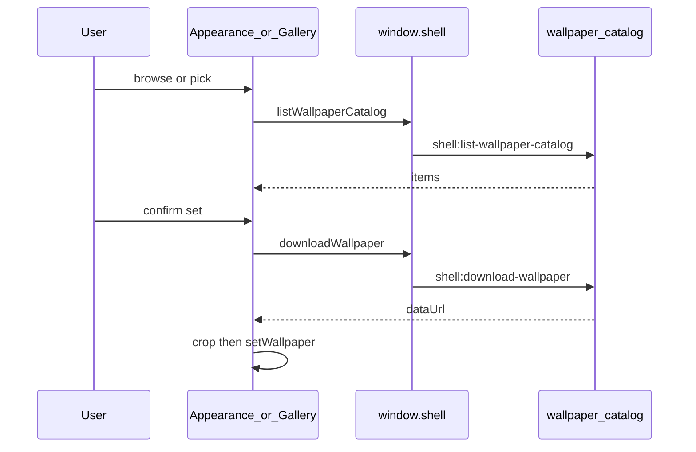

# 流程：设置壁纸

## 步骤（本地挑选）

1. 设置 → 外观 → 壁纸行 → 挑选本地图。
2. 打开裁剪（窗口比例 JPEG bake）。
3. 确认后写入 Host `ui-theme` 的 `wallpaperImage`；可调 frost / pixelate。

## 步骤（图库）

1. 壁纸行点「浏览图库」（无 desktop preload 则无此按钮）。
2. 图库窗：顶部分类页签 + 搜索，下方网格；可星标收藏。
3. 点缩略图 → 确认「设为壁纸」→ 是：`downloadWallpaper` → 裁剪；否：图库仍开、不换壁纸。
4. 图源 CRUD 只在图库窗内「图源」面板完成。

## 门槛

- QA：`TC-APP-002` … `TC-APP-010`
- Feature card：[../../features/wallpaper-gallery.md](../../features/wallpaper-gallery.md)

## 入口

- UI：`vendor/deepseek-harness/packages/client/ui-theme/src/client/WallpaperRow.tsx`、`WallpaperGalleryModal.tsx`
- Main：`src/main/wallpaper-catalog.js`
