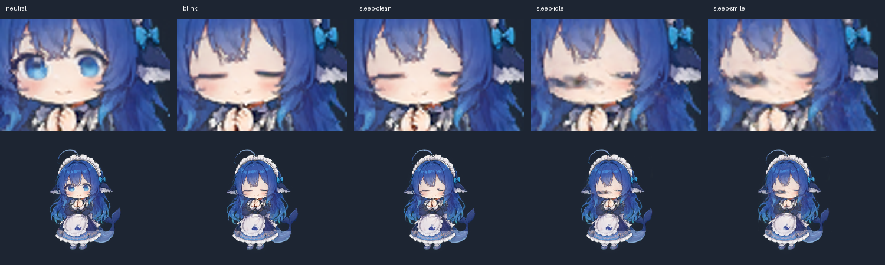
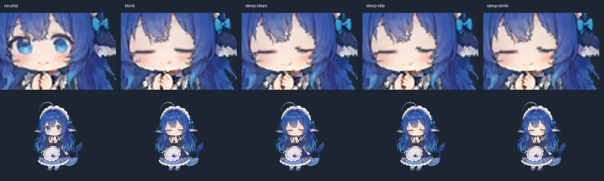
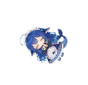
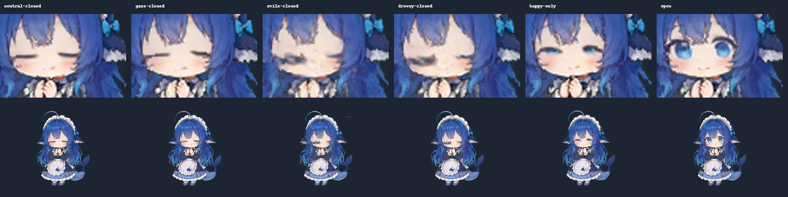
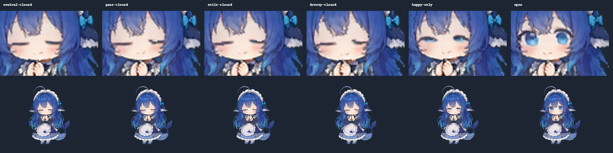
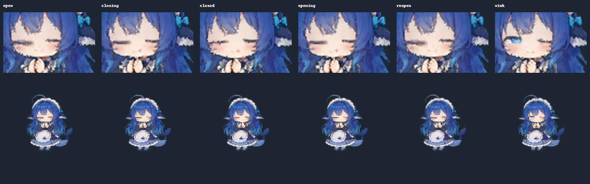

# 睡眠与待机闭眼位置、大小复核

2026-09-25，`desktop-live2d-pet`。

## 复现与定位

正式模型 `avatar/model.onnx` 与母版 `character.png` 不变。使用测试夹具加载真实 `pet-live2d.js`，向 `applyLiveState()` 输入确定的姿态，再以 CPU ONNX 实际推理；对照中从左到右为：中性、单独眨眼闭合、干净睡眠、带困倦与视线的睡眠、带随机笑眼的睡眠。

单独闭眼的宽度和位置正常。困倦的 relaxed-eye、随机 happy-eye 与 iris rotation 未被睡眠状态清除时，模型会输出扩大/偏移的眼线与残留眼形；不是睡姿整身旋转或 Anime4K 才产生的问题。入睡状态还会在动作程序之后重新写入固定困倦表情，因此只清除熟睡时的参数不够。

## 修复后

入睡逐渐退掉其他面部通道，熟睡时只保留自然闭眼的 12/13。后三列的模型输出逐像素相同，冲突输入不再改变闭眼的大小和位置。身体、头部与呼吸通道保留；没有重画眼睛、覆盖图层或替换模型。

Electron 重启后，在真实 WebGPU session、Anime4K 已启用的宠物窗口内注入相同冲突输入，经过正式表情程序与推理、绘制后截图。`electron.json` 记录运行后姿态与渲染路径；`electron-raw.png` 是超分和整体旋转前的模型帧。检查眼线未出现冲突输入造成的变粗、错位和残留睁眼形状。截帧结束后重新加载宠物页，恢复正常设置、位置与实时循环。

## 回归检查

`node --test src/main/desktop-live2d.test.js src/renderer/pet-live2d.test.js`：87/87。新增检查覆盖真实 `stepPose` 的困倦、未结束笑眼小动作、视线输入、入睡中点到闭眼完成，以及醒来恢复视线和正常眨眼。

修复前新增检查中熟睡隔离、入睡渐变失败；修复后通过。视觉结论来自上述模型与 Electron 画面对照，测试数字只表示面部控制和状态机没有回归。

全量 `npm test`：2329 通过、0 失败、2 跳过（共 2331 项）；`npm run doc-sync`：8/8。源码启动前检查发现旧客户端构建标识，完成自动重建后重启 Electron，实际宠物使用 WebGPU 与 Anime4K。

## 待机补修（同日用户追报）

上述首轮只覆盖睡眠，清醒时的待机眨眼仍会叠加随机笑眼、犯困眼形。以下真实模型推理对照依次为：中性闭眼、带视线闭眼、笑眼中闭合、犯困中闭合、仅笑眼、正常睁眼。前三种冲突场景均由真实 `stepPose()` 组合，未直接手绘或覆盖眼线。姿态快照保存在 `idle-poses-before.json` 与 `idle-poses-after.json`。

修复在 `applyLiveState()` 之后逐眼按自然闭合程度衰减同侧其他眼形，双眼同时闭合时退出共享瞳向。完全闭合时不再叠加笑眼或 relaxed-eye；单眼眨眼保留另一眼的表情与视线，嘴部和眉毛保持表达，重新睁开恢复原表情。睡眠仍沿用首轮较严格的面部独占控制。

Electron 重启后在正式 WebGPU + Anime4K 路径中核对：笑眼与困倦并存时的未眨眼、闭合中、全闭、睁开中、恢复原表情五阶段，以及单眼眨眼。上排是模型脸部放大，下排是实际 Electron 截图的身体区域（保留捕获像素尺寸）；不是连续实时录像。对应输入和渲染路径记录在 `electron-idle.json`；截图及原模型输出逐阶段保留。闭眼线的宽度和位置稳定，未再见冲突形态叠加造成的扩大；截帧后重新加载宠物页恢复正常状态与循环。

新增三项回归检查修复前失败、修复后通过：笑眼/打哈欠中的完全闭眼及恢复，单眼闭合隔离，动作表情覆盖后的渐进闭合。定向两件套 **90/90**。

本轮全量 `npm test` 为 **2330 通过、2 失败、2 跳过（共 2334）**，未宣称全量通过：`harness-desktop-forks.test.js` 的当前 vendor 包版本断言期望 `ui-agents-panel@0.1.7-rc.2`，实际为 `0.1.7-alpha.2`；`post-merge-ui.test.js` 仍读取已迁至 `ui-primitives` 的 `ui-attachment/src/ImageLightbox.module.css`。两处不经过桌宠姿态代码，未在本次眼形修复中改动。
