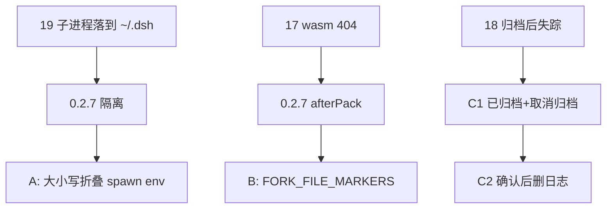
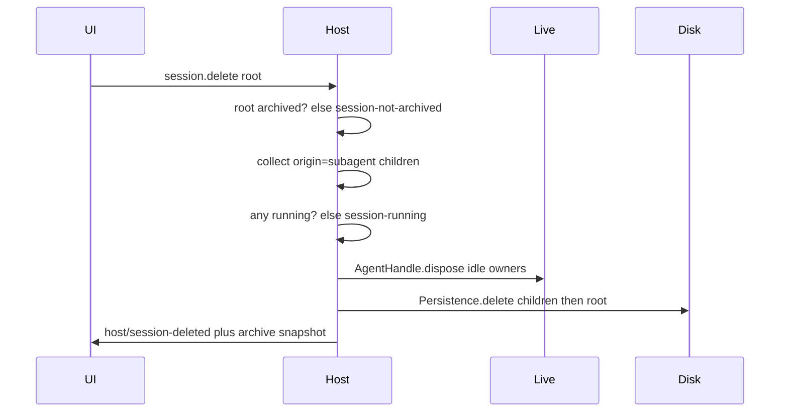

# GitHub issues 17 / 18 / 19 Implementation Plan

> **For agentic workers:** REQUIRED SUB-SKILL: Use superpowers:subagent-driven-development (recommended) or superpowers:executing-plans to implement this plan task-by-task. Steps use checkbox (`- [ ]`) syntax for tracking.

**Goal:** Close [#17](https://github.com/ChisaAlter/Deepseek-Harness-Desktop/issues/17) and [#19](https://github.com/ChisaAlter/Deepseek-Harness-Desktop/issues/19) against shipped v0.2.7 plus 0.2.8 spawn-env hardening, and ship sidebar restore plus archived-session hard delete for [#18](https://github.com/ChisaAlter/Deepseek-Harness-Desktop/issues/18).

**Architecture:** Four independently shippable tracks. A and B are desktop isolation/pack nets. C1 and C2 are official `dsh web` surfaces inside vendored harness: archive stays the live-row hide; **已归档** is the only place to unarchive or destroy logs. Persistence delete is a new seam. Host must retain `AgentHandle`s and dispose idle live owners before unlinking files. `host/session-removed` stays “detach”; durable delete uses a new `host/session-deleted` frame.

**Tech Stack:** Desktop Electron `src/shared/dsh-home.js` / `src/main/dsh.js`; vendor `@deepseek-ai/dsh-workspace`, `dsh-session-persistence` (+ jsonl/sqlite), `dsh-host-apiproxy`, `dsh-client-ui-workspace`, `dsh-client-runtime`.

**Spec:** This plan is the spec. Product cards: [dsh-home.md](../../features/dsh-home.md), [terminal-drawer.md](../../features/terminal-drawer.md), new [session-archive.md](../../features/session-archive.md) (created in C1). Upstream notes: [2026-07-31 session archive](../../../vendor/deepseek-harness/.agents/notes/implemented/feature/2026-07-31-session-archive-global-set.md), [2026-07-24 persistence delete groundwork](../../../vendor/deepseek-harness/.agents/notes/proposed/architecture/2026-07-24-domain-kv-storage-and-workspace.md) (implement the delete primitive; do not invent a second orchestration table).

## Global Constraints

- Follow official `dsh web` language: `ui-primitives`, `--dsw-alias-*`, existing Menu/Modal/`usePresence`. No second desktop skin.
- Chinese product copy; English code comments.
- Electron `process.env.DSH_HOME` stays unset; PTY must not inject desktop home (bottom-terminal `dsh` keeps `~/.dsh`).
- Do not change the skip-user-plugins FSM. Isolation is child `DSH_HOME`, not skip.
- Do not coerce `credentials-local` YAML types. Do not extraResources Ghostty wasm.
- Do not put Delete on the live session row menu.
- Delete subtree = requested archived root + sessions with `origin === 'subagent'` whose `parentSession` chain stays inside that set. Forks also carry `parentSession` (seed lineage) but have no `origin`; **do not delete them**.
- Do not GC attachment blobs. Do not cascade message-feedback this round.
- Vendor changes need an Agent Note (EN+ZH), JSDoc `@param`/`@returns`, 100% package coverage, `pnpm run test:gui`; visible UI also `DSH_SNAPSHOT=replay pnpm run test:web` in `vendor/deepseek-harness`.
- `dsh-home` card **Do not touch vendor** applies only to Track A. C1/C2 **must** edit vendor harness; declare `Touching: session-archive`.
- Commit subjects: `fix(dsh-home): …`, `fix(terminal-drawer): …`, `feature(session-archive): …`.
- Do not commit unless the user asks. GitHub comments are last in each track.
- Windows x64 CI Setup is the release artifact. `qa:packaged` is rehearsal, not production Pass.

## Delivery vs GitHub

| Issue | User-facing close | Extra 0.2.8 work |
| --- | --- | --- |
| #19 启动失败 | Comment: install [v0.2.7](https://github.com/ChisaAlter/Deepseek-Harness-Desktop/releases/tag/v0.2.7) (desktop home). Close if they confirm, or after a reasonable wait. Reporter is on **0.2.6**, which had no isolation. | Case-fold spawn `DSH_HOME` (Track A). If 0.2.7 still logs `\.dsh\.credentials.yaml`, open a **new** issue from child vs Boot home mismatch. |
| #17 Ghostty 404 | Comment: install 0.2.7; close after wasm 200 on that build. | Pin `copy-ghostty-assets.mjs` in `FORK_FILE_MARKERS` (Track B). |
| #18 归档 | C1 comment: restore lives under **已归档**. Close only after C2 delete ships in 0.2.8. | C1 unarchive, then C2 hard delete. |

Do not hold #19/#17 open for 0.2.8 hardening.



---

## File map

**Track A (`Touching: dsh-home`)**

- Modify: `src/shared/dsh-home.js` — case-insensitive strip of `DSH_HOME` then set desktop path
- Modify: `src/shared/dsh-home.test.js` — `dsh_home` / `Dsh_Home` / `DSH_HOME` on a plain object
- Modify: `src/main/dsh.js` — log child `DSH_HOME` from the spawn-time env (not the `whenReady` line)
- Modify: `src/main/dsh.test.js` — fake `spawnHarness` must record `options.env`; assert desktop home
- Modify: `docs/qa/production-acceptance-test-cases.md` — TC-INST-011 credentials poison
- Modify: `docs/features/dsh-home.md` `last verified`

`pluginEnv` in `src/main/marketplace-install.js` already calls `applyDesktopDshHome`. Do **not** export `pluginEnv`. Do **not** change its `cwd: os.homedir()`. Coverage is the fold unit test plus the real spawn capture.

**Track B (`Touching: terminal-drawer`)**

- Modify: `src/shared/harness-desktop-forks.js` `FORK_FILE_MARKERS`
- Modify: `src/shared/harness-desktop-forks.test.js` fixture `content['package.json']`
- Manual: installed 0.2.7 `TC-TERM-001` wasm 200
- Modify: `docs/features/terminal-drawer.md` `last verified` when the pin lands

**Track C1 (`Touching: session-archive`)** — restore only

- Create: `docs/features/session-archive.md`; row in `docs/features/README.md`
- Modify vendor: `packages/workspace/workspace/src/index.ts` + `tests/workspace.spec.ts`
- Modify vendor: `packages/host/apiproxy/src/api/workspace.ts`, `workspace.schema.ts`, `rpc-map.ts`, `fetch/handler.ts`, `fetch/client.ts`, `api-proxy.ts` + workspace specs
- Modify vendor: `packages/client/runtime/src/client/contract/workspaces.ts`, `workspaces/service.ts`, `workspaces/manager.ts`, fake-api, fixture
- Modify vendor: `packages/client/ui-workspace/src/client/tree.ts`, `locales.ts`, `rows/Rows.tsx`, `WorkspaceBrowser.tsx`, `index.ts`, `contract/slots.ts`
- Modify vendor: ui-workspace tests; **must update** `apps/web/tests/workspace-management.e2e.ts` (existing archive test currently asserts the title is gone after reload — after C1 it must appear under Archived)
- Modify vendor: Agent Note 2026-07-31 (present tense: unarchive exists; delete still later); ui-workspace README Known Limitations
- Modify: `docs/qa/production-acceptance-test-cases.md` `TC-CHAT-010`

**Track C2 (`Touching: session-archive`)** — destroy logs; depends on C1 UI group

- Modify vendor: `packages/session/session-persistence/src/index.ts` + `coordinator.ts` + `tests/contract.ts`
- Modify vendor: `session-persistence-jsonl` (rm session-owned directory) + `session-persistence-sqlite` + in-memory backend used by the contract
- Modify vendor: `packages/host/apiproxy` `session.delete` + retain `AgentHandle` on create/resume + `host/session-deleted` in `api/events.ts` / `events.schema.ts`
- Modify vendor: client runtime drop list rows on `host/session-deleted` (do not overload `host/session-removed`)
- Modify vendor: ui-workspace archived-row danger Delete + Modal (workspace-delete recipe)
- Create vendor: `.agents/notes/implemented/feature/2026-08-23-archived-session-delete.md` + `.zh.md`
- Modify: feature card + README Known Limitations (delete exists, archived-only)
- Modify: QA `TC-CHAT-011`

**Out of scope (all tracks)**

- `credentials-local` parser coerce; skip FSM; Electron/PTY `DSH_HOME`; extraResources wasm; live-row Delete; attachment blob GC; message-feedback cascade; `session.delete` of non-archived ids; Python SDK (no `archiveSession` today); deleting fork children of the archived root

---

## Track A — #19 spawn env isolation

**Facts:** `dsh-base` always mounts `credentials-local` against `$DSH_HOME/.credentials.yaml`. `--skip-user-plugins` does not skip that row. Vendor `resolveDshHome()` falls back to `join(homedir(), '.dsh')` if child env is empty/whitespace. `DOCUMENT_VERSION` is number `1`; YAML `version: 1` is valid. Issue text `the value for "version" must be a string` is `parseRefs` (a `refs` value is not a string). **The path is the bug.**

`{ ...process.env }` can keep both `DSH_HOME` and `dsh_home`. `prependPath` already folds `PATH`; `applyDesktopDshHome` currently only assigns `next.DSH_HOME`. Windows `CreateProcess` is case-insensitive.

Existing `spawnEnv()` unit tests do not prove `_spawnHarness` received that env: `makeHarness` fake at `src/main/dsh.test.js` ~L89 ignores arguments. Boot log `Harness 家目录` is written in `whenReady` **before** spawn.

### Task A1: Case-fold `applyDesktopDshHome`

**Files:**
- Modify: `src/shared/dsh-home.js`
- Test: `src/shared/dsh-home.test.js`

**Produces:** `applyDesktopDshHome(env)` returns a new object whose only `DSH_HOME` key (exact spelling) is `getDesktopDshHome()`; every key matching `/^DSH_HOME$/i` is removed first. Input object is not mutated.

- [ ] **Write the failing test** in `dsh-home.test.js` (keep the existing overwrite test):

```js
test('applyDesktopDshHome drops case variants then sets DSH_HOME', () => {
  const configured = path.join(os.tmpdir(), 'configured-dsh-home');
  setDesktopDshHome(configured);
  const inherited = path.join(os.homedir(), '.dsh');
  const input = { dsh_home: inherited, Dsh_Home: inherited, DSH_HOME: inherited, KEEP: 'yes' };
  const env = applyDesktopDshHome(input);
  assert.equal(env.DSH_HOME, path.resolve(configured));
  assert.equal(env.KEEP, 'yes');
  assert.equal('dsh_home' in env, false);
  assert.equal('Dsh_Home' in env, false);
  assert.equal(input.dsh_home, inherited);
});
```

- [ ] Run: `node --test src/shared/dsh-home.test.js` — expect FAIL (variants still present).
- [ ] Implement in `applyDesktopDshHome`:

```js
function applyDesktopDshHome(env = {}) {
  const next = { ...env };
  for (const key of Object.keys(next)) {
    if (key.toUpperCase() === 'DSH_HOME') delete next[key];
  }
  next.DSH_HOME = getDesktopDshHome();
  return next;
}
```

- [ ] Re-run the file — expect PASS.

### Task A2: Assert real spawn options + child log

**Files:**
- Modify: `src/main/dsh.js` (`_start` around the `_spawnHarness` call ~L762)
- Modify: `src/main/dsh.test.js` (`makeHarness` `spawnHarness` ~L89)

**Produces:** `_spawnHarness(command, args, options)` is invoked with `options.env.DSH_HOME === getDesktopDshHome()`. Start logs one line `子进程 DSH_HOME <path>` using that value. Electron `process.env.DSH_HOME` remains unset.

- [ ] Change the fake to record arguments (keep existing fake child + ready announce):

```js
spawnHarness: (command, args, options) => {
  calls.spawn = { command, args, options };
  const pid = overrides.childPid !== undefined ? overrides.childPid : CHILD_PID;
  const child = makeFakeChild(pid);
  spawned.push(child);
  if (reachable && overrides.announceReady !== false) {
    queueMicrotask(() => child.stdout.emit('data', Buffer.from(`dsh web: ${EXPECTED_URL}\n`)));
  }
  return child;
},
```

Add `spawn: null` to the `calls` object initializer.

- [ ] Add a test (restore `process.env.dsh_home` in `t.after`):

```js
test('start passes desktop DSH_HOME to spawnHarness even when dsh_home is inherited', async (t) => {
  const inherited = path.join(os.homedir(), '.dsh');
  const previous = process.env.dsh_home;
  process.env.dsh_home = inherited;
  t.after(() => {
    if (previous === undefined) delete process.env.dsh_home;
    else process.env.dsh_home = previous;
  });
  const h = makeHarness();
  h.setReachable(true);
  await h.manager.start();
  const { getDesktopDshHome } = require('../shared/dsh-home');
  assert.equal(h.calls.spawn.options.env.DSH_HOME, getDesktopDshHome());
  assert.equal('dsh_home' in h.calls.spawn.options.env, false);
});
```

- [ ] Run: `node --test src/main/dsh.test.js` — expect FAIL (`calls.spawn` undefined or official path).
- [ ] In `dsh.js` `_start`, after computing launch, do:

```js
const env = this.spawnEnv(config, launch.nodeBin);
this.log(`子进程 DSH_HOME ${env.DSH_HOME}`);
child = this._spawnHarness(launch.command, launch.args, {
  cwd: config.workspace,
  env,
  stdio: ['ignore', 'pipe', 'pipe'],
});
```

Do **not** assign `process.env.DSH_HOME` on Electron.

- [ ] Re-run `dsh.test.js` — expect PASS.

### Task A3: TC-INST-011 credentials poison + issue comment

**Files:**
- Modify: `docs/qa/production-acceptance-test-cases.md`
- Modify: `docs/features/dsh-home.md` `last verified`

- [ ] Keep the existing bad-bundle poison. Add sibling **TC-INST-011b** immediately after TC-INST-011:

```markdown
### TC-INST-011b · 官方 credentials.yaml 毒化不能拖死桌面 · P0（造障）

**前置：** 官方 `~/.dsh/.credentials.yaml` 写入非 string 的 `refs` 值（issue #19 形态）。桌面包为 v0.2.7+。

**步骤：**

1. 冷启动桌面应用。
2. 读 Boot 日志里的 `Harness 家目录` 与 `子进程 DSH_HOME`。
3. 确认官方 `~/.dsh/.credentials.yaml` 字节未改。
4. 底栏终端运行官方 `dsh`（若已安装）：仍使用 `~/.dsh`。

**期望：** 进入 Web UI。两行 home 都在 `%APPDATA%\Deepseek-Harness-Desktop\dsh-home`（或测试 `DSHD_HOME`）。stderr / 子进程输出不得含 `\.dsh\.credentials.yaml`。官方文件未改写。
```

- [ ] GitHub #19 comment (then close on confirm / reasonable wait):

> v0.2.6 的 `dsh web` 子进程会落到官方 `~/.dsh`，所以会读 `~\.dsh\.credentials.yaml`。请改装 [v0.2.7](https://github.com/ChisaAlter/Deepseek-Harness-Desktop/releases/tag/v0.2.7)：桌面只用 `%APPDATA%\Deepseek-Harness-Desktop\dsh-home`，不再读官方 home。会话 / 主题 / 自定义模型需要在桌面里重配。若 0.2.7 仍出现 `\.dsh\.credentials.yaml`，请附启动日志里的 `子进程 DSH_HOME` 开新 issue。

**Track A gate:** `node --test src/shared/dsh-home.test.js src/main/dsh.test.js`

---

## Track B — #17 Ghostty pin + close

**Facts:** v0.2.6 packed `lib/client.js` without `lib/assets`. HEAD `afterPack` fail-closes; `build:lib:client` in `vendor/deepseek-harness/package.json` already ends with `node packages/client/ui-user-terminal/scripts/copy-ghostty-assets.mjs`. That script line is a **desktop fork** not listed in `FORK_FILE_MARKERS`, so `sync:harness` can drop it. Host only reads `dirname(client.js)/assets/` **inside the extracted tar** — extraResources would not fix the plugin URLs.

### Task B1: Pin the copy hook

**Files:**
- Modify: `src/shared/harness-desktop-forks.js`
- Modify: `src/shared/harness-desktop-forks.test.js`

- [ ] Append to `FORK_FILE_MARKERS`:

```js
{ file: 'package.json', includes: ['copy-ghostty-assets.mjs'] },
```

- [ ] In `makeFixture` `content` map add:

```js
'package.json': '"build:lib:client": "node packages/client/ui-user-terminal/scripts/copy-ghostty-assets.mjs"\n',
```

Without this, the complete-fixture test writes `export {}\n` for `package.json` and fails.

- [ ] Add a regression test:

```js
test('assertDesktopForks throws when copy-ghostty-assets drops out of package.json', (t) => {
  const root = makeFixture(t);
  fs.writeFileSync(path.join(root, 'package.json'), '{}\n');
  assert.throws(() => assertDesktopForks(root, '0.1.0-rc.5'), /copy-ghostty-assets/);
});
```

- [ ] Run: `node --test src/shared/harness-desktop-forks.test.js` — must include `assertDesktopForks accepts the current vendor tree at rc.1` against `vendor/deepseek-harness` at `0.1.1-rc.1`.

### Task B2: Verify 0.2.7 + issue comment

- [ ] On installed **v0.2.7** (or this SHA’s CI Setup): open terminal drawer; no `Unable to load libghostty-vt (404)`. Probe `http://127.0.0.1:<port>/plugins/@deepseek-ai/dsh-client-ui-user-terminal/assets/` for `ghostty-vt.wasm`, `ghostty-write-pty.wasm`, `SymbolsNerdFontMono-Regular.woff2` → 200 (`TC-TERM-001`).
- [ ] If still 404: inspect `userData/runtime/0.2.7/node_modules/@deepseek-ai/dsh-client-ui-user-terminal/lib/assets/`. Only then touch `harness-extract.js` stamp. Default: do not change pack scripts.
- [ ] GitHub #17:

> 请改装 [v0.2.7](https://github.com/ChisaAlter/Deepseek-Harness-Desktop/releases/tag/v0.2.7)。该版本打包会把 Ghostty wasm/字体放进 `lib/assets/`，底栏终端不应再出现 `Unable to load libghostty-vt (404)`。确认后关单。

**Track B gate:** forks tests green; TC-TERM-001 on CI installer (not `qa:packaged` as Pass).

---

## Track C1 — #18 unarchive (ship before C2)

**Facts:** Archive hides the row on all grouping surfaces; logs and `sessionIds` slots stay. No unarchive RPC. Desktop `src/` does not filter archived ids. Client archive of the current session calls `sessions.clear()` — Host live Session may remain.

**User path:** Live row ⋯ → 归档会话 (unchanged, no confirm). Sidebar bottom group **已归档** / **Archived** (hidden when empty). Row ⋯ → **取消归档** (not danger, no confirm). Click archived row = unarchive then open. Row returns to its workspace `sessionIds` position. Do **not** keep a session archived while it is open.

**Copy (zh / en):**

| key | zh | en |
| --- | --- | --- |
| `section.archived` | 已归档 | Archived |
| `menu.unarchiveSession` | 取消归档 | Unarchive session |

### Task C1a: Feature card

**Files:**
- Create: `docs/features/session-archive.md`
- Modify: `docs/features/README.md` index table

Card body (do not invent extra invariants):

```markdown
# Feature: Session archive

| Field | Value |
| --- | --- |
| **id** | `session-archive` |
| **status** | `active` |
| **last verified** | 2026-08-23 — plan; C1 unarchive not yet shipped |

## User paths

1. 活会话行 ⋯ → 归档会话：行从项目/任务/平铺/搜索消失，日志与工作区 `sessionIds` 槽位保留。
2. 侧栏底部 **已归档**：点行 = 取消归档并打开；⋯ → 取消归档。
3. 已归档 ⋯ → 删除会话（C2）：确认后永久删除该会话日志；工作区文件夹不动。

## Invariants

- 活会话菜单只有归档，没有删除。
- 恢复与销毁只出现在「已归档」。
- 打开已归档行必须先取消归档；不得以归档态停留在主视图。
- 桌面不另做会话浏览器；走官方 `ui-workspace`。
- 删除只接受已归档的请求根；子 agent（`origin === 'subagent'`）随根删除；fork 不随根删除。

## Allowed touch

- `vendor/deepseek-harness/packages/workspace/workspace/`
- `vendor/deepseek-harness/packages/host/apiproxy/` workspace + sessions API
- `vendor/deepseek-harness/packages/client/runtime/` workspaces + sessions
- `vendor/deepseek-harness/packages/client/ui-workspace/`
- `vendor/deepseek-harness/packages/session/session-persistence*`（仅 C2）
- 本卡、QA TC-CHAT-010 / TC-CHAT-011

## Do not touch

- Appearance / 图库 / 市场
- 活会话行上的删除
- Electron / PTY `DSH_HOME`
- 附件 blob GC、message-feedback 级联

## Gates

| Kind | What |
| --- | --- |
| Automated | vendor workspace + apiproxy + `pnpm run test:gui`；可见 UI 另跑 `DSH_SNAPSHOT=replay pnpm run test:web` |
| Manual / QA | `TC-CHAT-010` 取消归档；`TC-CHAT-011` 硬删除（C2） |

## Sources

- Spec / plan: [2026-08-23-github-issues-17-18-19.md](../superpowers/plans/2026-08-23-github-issues-17-18-19.md)
- Agent Note: `vendor/deepseek-harness/.agents/notes/implemented/feature/2026-07-31-session-archive-global-set.md`
```

Index row: `| [session-archive](session-archive.md) | 归档隐藏；已归档里恢复/删除 | ui-workspace / workspace RPC | TC-CHAT-010、011 |`

### Task C1b: Registry + RPC

**Files:**
- Modify: `vendor/deepseek-harness/packages/workspace/workspace/src/index.ts`
- Test: `vendor/deepseek-harness/packages/workspace/workspace/tests/workspace.spec.ts` (`describe('registry-global session archive')` ~L875)
- Modify: `vendor/deepseek-harness/packages/host/apiproxy/src/api/workspace.ts`
- Modify: `vendor/deepseek-harness/packages/host/apiproxy/src/api/workspace.schema.ts`
- Modify: `vendor/deepseek-harness/packages/host/apiproxy/src/api/rpc-map.ts`
- Modify: `vendor/deepseek-harness/packages/host/apiproxy/src/fetch/handler.ts` + `fetch/client.ts`
- Modify: `vendor/deepseek-harness/packages/host/apiproxy/src/api-proxy.ts` (mirror `archiveSession` ~L2911)
- Test: `vendor/deepseek-harness/packages/host/apiproxy/tests/api-proxy-workspace.spec.ts`, `rpc-schemas.spec.ts`

**Consumes:** existing `archiveSession` / `WorkspaceUnknownSessionError` / `host/archived-sessions-changed` full snapshot.

**Produces:**

```ts
// WorkspaceRegistry
unarchiveSession(sessionId: SessionId): Promise<void>
// enqueueOperation; if id not in archivedSessionIds → resolve without write
// unknown id → WorkspaceUnknownSessionError (same as archive)

// WorkspaceApi
unarchiveSession(request: RpcRequest<{ sessionId: SessionId }>):
  Promise<RpcResponse<{ archivedSessionIds: SessionId[] }>>
```

- [ ] **Write the failing domain tests** next to the archive suite:

```ts
it('unarchives durably, idempotently skips ids not in the set, and leaves accounting untouched', async () => {
  const dir = await makeDir('unarchive-home')
  const result = await harness({ sessions: [header('kept', dir, 100), header('gone', dir, 200)] })
  const workspace = result.registry.list()[0]!
  await result.registry.archiveSession(SessionId('gone'))
  expect(workspace.sessionIds).toContain('gone')

  await result.registry.unarchiveSession(SessionId('gone'))
  expect(result.registry.archivedSessionIds).toEqual([])
  expect(workspace.sessionIds).toContain('gone')
  expect(storedState(result.pool).archivedSessionIds).toEqual([])

  const changes = result.changes.filter(change => change.table === '').length
  await result.registry.unarchiveSession(SessionId('gone'))
  expect(result.changes.filter(change => change.table === '').length).toBe(changes)
})

it('rejects unknown unarchive ids without writing', async () => {
  const result = await harness({ sessions: [] })
  await expect(result.registry.unarchiveSession(SessionId('ghost')))
    .rejects.toThrow(/cannot archive session 'ghost'|cannot unarchive session 'ghost'/)
  expect(storedState(result.pool).archivedSessionIds).toEqual([])
})
```

Use a dedicated `WorkspaceUnknownSessionError` message that names unarchive if you add one; otherwise reuse the existing unknown-session error. Pick one spelling and use it in both the throw and the test.

- [ ] Run the workspace package test for that describe — expect FAIL (`unarchiveSession` missing).
- [ ] Implement `unarchiveSession` as the inverse of `archiveSession`: filter the id out of `archivedSessionIds`; no-op if absent; `sessionKnown` check if you need to distinguish ghost vs already-unarchived. **Already-unarchived known id is a no-op.** Unknown id throws.
- [ ] Mirror RPC: schema twins of `workspaceArchiveSession*`, rpc-map key `'workspace.unarchiveSession'`, handler like archive that returns `{ archivedSessionIds: [...ctx.workspaceRegistry.archivedSessionIds] }`, `session-not-found` for `WorkspaceUnknownSessionError`.
- [ ] api-proxy tests: echo full set after unarchive; `session-not-found` for ghost id.
- [ ] Run workspace + apiproxy workspace specs — expect PASS.

### Task C1c: Client runtime + sidebar

**Files:**
- Modify: `packages/client/runtime/src/client/contract/workspaces.ts` — add `unarchiveSession(sessionId: SessionId): Promise<void>`
- Modify: `packages/client/runtime/src/client/workspaces/manager.ts` — twin of `archiveSession` (~L228)
- Modify: `packages/client/runtime/src/client/workspaces/service.ts`
- Modify: connection/runtime fake-api + fixture (`workspace.archiveSession` sites)
- Modify: `packages/client/ui-workspace/src/client/contract/slots.ts` inject `unarchiveSession`
- Modify: `packages/client/ui-workspace/src/client/index.ts`
- Modify: `packages/client/ui-workspace/src/client/tree.ts`
- Modify: `packages/client/ui-workspace/src/client/locales.ts`
- Modify: `packages/client/ui-workspace/src/client/rows/Rows.tsx`
- Modify: `packages/client/ui-workspace/src/client/WorkspaceBrowser.tsx`
- Test: `tree.client.spec.ts`, `workspace-browser.client.spec.tsx`, `workspaces-service.client.spec.ts`
- Test: `apps/web/tests/workspace-management.e2e.ts` **existing** archive test ~L590

**Produces:** `IWorkspaces.unarchiveSession(sessionId: SessionId): Promise<void>`

- [ ] Runtime manager: on success `installArchived(result.value.archivedSessionIds)` (same as archive). Service throws `session unarchive failed: ${code}: ${message}` on `!result.ok`.
- [ ] `tree.ts` add:

```ts
export function deriveArchived(
  list: SessionListState,
  archivedSessionIds: readonly SessionId[],
): SessionNode[] {
  const descendants = indexSubagentDescendants(list.byId)
  const rows: SessionSummary[] = []
  for (const id of archivedSessionIds) {
    const s = list.byId[id]
    if (s === undefined || s.origin === 'subagent') continue
    rows.push(s)
  }
  return rows.map(session => sessionNode(session, descendants))
}
```

Preserve archive-set order. Do **not** put archived ids through `sessionVisible` for Projects/Tasks/flat/search (search still never matches archived ids).

- [ ] `WorkspaceBrowser`: after `SessionTree` / `FlatList` (not inside search results), render a section titled `t('section.archived')` when `deriveArchived(...).length > 0`. Empty → do not render the section. Archived rows are not draggable.
- [ ] New row component or `SessionNodeItem` variant: menu is **only** unarchive in C1 (no rename/fork/archive, no delete yet). Live `SessionNodeItem` menu unchanged (`rename` / `fork` / `archive`).
- [ ] Click archived row:

```ts
const onOpenArchived = (sessionId: SessionNode['id']) => {
  unarchiveSession(sessionId).then(() => { open(sessionId) }).catch((reason: unknown) => {
    console.warn('session unarchive rejected:', reason)
  })
}
```

Unarchive menu: `unarchiveSession(id)` only (do not open).

- [ ] Locales zh+en for the two keys above.
- [ ] Component tests: archive hides from Tasks and shows under Archived; unarchive menu calls `unarchiveSession`; click calls unarchive then open.
- [ ] **Rewrite** the e2e `archives the seeded session...` so after archive:
  - Tasks no longer contains `rowTitle`
  - `page.getByText('Archived', { exact: true })` is visible
  - `rowTitle` is visible under that section
  - after reload, still under Archived, still in `archivedSessionIds`, log still in `sessionPersistence.list()`
  Then add a follow-on assertion in the same test or a new test: Unarchive session → row leaves Archived → appears back under Tasks → still there after reload → `archivedSessionIds` is `[]`.

- [ ] Run: in `vendor/deepseek-harness`, `pnpm run test:gui` and `DSH_SNAPSHOT=replay pnpm run test:web` (workspace-management e2e). Expect PASS.

### Task C1d: Docs + QA + issue

- [ ] Update 2026-07-31 Agent Note present tense: unarchive surface exists under Archived; delete still later. Pair ZH. Do not narrate “previously”.
- [ ] ui-workspace README Known Limitations: replace “No Session deletion or unarchive control” with “No Session deletion control — archived sessions restore from the Archived section; Workspace registration deletion does not delete Sessions.”
- [ ] QA **TC-CHAT-010**: archive → 已归档 → unarchive → row back. Object = CI Setup after 0.2.8. Add the case in §4 and a results-table row.
- [ ] Comment #18 (do **not** close):

> 归档不是删除，日志还在。恢复会做在侧栏底部「已归档」：点行或菜单「取消归档」。永久删除日志是下一步（确认对话框），随 0.2.8。

**Track C1 gate:** vendor workspace + apiproxy + `pnpm run test:gui`; e2e replay for workspace-management. Desktop `src/` unchanged.

---

## Track C2 — #18 delete archived logs (after C1)

**Facts:** `SessionPersistence` has no `delete`. `host/session-removed` is `session/disposed` (detach / idle subagent). Feedback sidecar must not treat that frame as durable delete. JSONL layout is `<root>/<project>/<encoded-id>/session.jsonl.zstd` — delete the **directory**, not one file. Attachment GC is deferred upstream (forks share blobs). `parentSession` is seed lineage for **both** forks and subagents; only `origin === 'subagent'` is a hidden child.

**User path:** In 已归档, ⋯ → **删除会话** (danger) → Modal same recipe as workspace delete (`WorkspaceBrowser.tsx` ~L1363). Copy must say logs are gone forever; workspace folder is untouched. Clicking the row unarchives (C1), so delete is **menu-only while still archived**.

**Copy:**

| key | zh | en |
| --- | --- | --- |
| `menu.deleteSession` | 删除会话 | Delete session |
| `delete.session.title` | 删除会话 | Delete session |
| `delete.session.desc` | 将永久删除「{name}」的对话记录，无法恢复。工作区文件夹不受影响。 | This permanently deletes the conversation log for "{name}". It cannot be recovered. The workspace folder is unchanged. |
| `delete.session.pending` | 正在删除会话… | Deleting session… |
| `delete.session.running` | 会话仍在运行，请先停止后再删除。 | The session is still running. Stop it before deleting. |

**Host rules (locked):**

1. `session.delete({ sessionId })` — **root** must be in `archivedSessionIds` else `session-not-archived`.
2. Deletable set = `{ root }` plus every persisted/live header with `origin === 'subagent'` whose `parentSession` is already in the set (iterate until fixed point). Nested subagents included. Forks (`parentSession` set, `origin` absent) **excluded**. `dshbot` origins excluded.
3. Any agent in the deletable set with `status === 'running'` → delete nothing, `session-running`.
4. Idle live owners: Host **disposes** them first via retained `AgentHandle.dispose()`; persistence never calls into runtime.
5. Persistence delete leaves (subagents) then root; missing id skip (crash resume).
6. Then drop root from `archivedSessionIds`; detach whole deletable set from workspace `sessionIds` (subagents are usually unaccounted).
7. Publish after commit: `host/session-deleted` per deleted id (new frame) + `host/archived-sessions-changed`. Do not emit `host/session-removed` for this path.
8. Success `{ deletedSessionIds, archivedSessionIds }`.

**Live handles (required):** `api-proxy.ts` `ensure`/`create`/`resume` (~L1637, ~L1650, and the other `ctx.agents.create` ~L2423) currently return `.agent` and **drop** `AgentHandle`. C2 must keep `Map<SessionId, AgentHandle>` populated on every successful create/resume, delete the entry in `handle.dispose()`, and fail the whole `session.delete` if a live `ctx.agents.get(id)` exists without a handle (`session-live-unowned` — do not invent a second teardown on `AgentRegistry`). Cold archived sessions with no live agent skip dispose and only persist-delete.



### Task C2a: Persistence seam

**Files:**
- Modify: `packages/session/session-persistence/src/index.ts` (abstract `delete`)
- Modify: `packages/session/session-persistence/src/coordinator.ts` (queue on the per-id write chain)
- Modify: `packages/session/session-persistence/tests/contract.ts`
- Modify: jsonl backend (`sessionDir` already in `format.ts`) + sqlite backend + memory backend used by `runPersistenceContract('memory', …)`
- JSONL README Known Limitation “Nothing deletes session files”

**Produces:**

```ts
/**
 * Remove one session's durable log. Unknown id rejects.
 * An un-materialized create cancels and resolves.
 * After success the id is unknown to load/list.
 * @param id - session to delete.
 * @returns resolution after durability.
 */
abstract delete(id: SessionId): Promise<void>
```

Emit `session-persistence/deleted` (`@mode emit`, `@param id`). Coordinator: enqueue on that session's write chain so an in-flight append either finishes then delete, or delete wins by serialization — pick one and test it; do not delete bytes under an open writer.

- [ ] **Write the failing contract tests** inside `runPersistenceContract`:

```ts
it('delete removes a materialized session from load and list', async () => {
  const { persistence, dispose } = await make()
  try {
    const m = meta('to-delete', '/work')
    await persistence.create(m)
    await persistence.append(m.id, oneTurnLog())
    await persistence.delete(m.id)
    await expect(persistence.load(m.id)).rejects.toThrow()
    expect((await persistence.list()).map(h => h.id)).not.toContain(m.id)
  } finally {
    await dispose()
  }
})

it('delete of an unknown id rejects', async () => {
  const { persistence, dispose } = await make()
  try {
    await expect(persistence.delete(SessionId('ghost'))).rejects.toThrow()
  } finally {
    await dispose()
  }
})
```

JSONL-only extra (in `jsonl.spec.ts`): after delete, `sessionDir(root, cwd, id)` does not exist; empty project dir is best-effort `rmdir`.

- [ ] Run persistence contract for memory — expect FAIL.
- [ ] Implement abstract + coordinator + three backends. SQLite: one transaction delete events + sessions rows.
- [ ] session-query: existing list-observation already treats ids missing from `list()` as `persistentDeletes`. Add a sqlite/query test that after `persistence.delete`, the next search does not hit that session. Do not add a poller. Optionally `ctx.on('session-persistence/deleted', …)` if a dirty path already exists.
- [ ] message-feedback: **no** cascade; Agent Note records orphan sidecar as accepted.
- [ ] Re-run jsonl + sqlite + memory contracts — expect PASS.

### Task C2b: `session.delete` RPC + frames

**Files:**
- Modify: `packages/host/apiproxy/src/api/sessions.ts` — add method on `SessionsApi`
- Modify: sessions schema + `rpc-map.ts` + fetch handler/client
- Modify: `packages/host/apiproxy/src/api/events.ts` + `events.schema.ts` — `| { type: 'host/session-deleted'; sessionId: SessionId }`
- Modify: `api-proxy.ts` — retain handles; implement delete
- Modify: `packages/client/runtime/src/client/sessions/manager.ts` — `host/session-deleted` drops the summary (unlike `host/session-removed`, which keeps durable subagents idle)
- Tests: api-proxy session delete specs; `manager.client.spec.ts`; `rpc-schemas.spec.ts`

**Produces:**

```ts
delete(request: RpcRequest<{ sessionId: SessionId }>):
  Promise<RpcResponse<{ deletedSessionIds: SessionId[]; archivedSessionIds: SessionId[] }>>
```

Error codes: `session-not-archived`, `session-running`, `session-live-unowned`, `session-not-found`.

- [ ] Tests first: not archived; running; recursive subagent (child not archived, still deleted); fork child of the root still listed; after success `locate`/`load` missing; live idle owner gone from `ctx.agents.get`.
- [ ] Implement handle map + delete orchestration as specified above.
- [ ] Client `host/session-deleted`: `recordMutation({ kind: 'remove', sessionId })` for **every** deleted id including former subagents (this is durable destruction, not detach).

### Task C2c: UI delete

**Files:**
- Modify: `slots.ts` / `index.ts` inject `deleteSession: (sessionId: SessionId) => Promise<void>`
- Modify: archived row menu: unarchive + danger delete (`className` matching workspace delete action)
- Modify: `WorkspaceBrowser.tsx` — second Modal state (`sessionDeleteTarget`), copy from workspace delete (`deleting` disables Cancel/Confirm; failure keeps dialog; Escape before submit does not delete)
- Test: `workspace-browser.client.spec.tsx` — confirm calls `deleteSession`; cancel does not; live row has no delete item
- e2e: archive → confirm delete → reload: row gone from Archived, id not in `sessionPersistence.list()`, jsonl session directory gone

Map `session-running` to `t('delete.session.running')` in the dialog error slot.

### Task C2d: Docs + QA + close #18

- [ ] New implemented Agent Note EN+ZH: archived-root-only, `origin === 'subagent'` children, dispose-then-delete, new frame vs removed, no attachment GC, no feedback cascade, handle map.
- [ ] Update 2026-07-31 note: destroy surface exists (present tense). Pair ZH.
- [ ] persistence-jsonl README: drop “Nothing deletes session files”; state delete removes the session-owned directory.
- [ ] Feature card: add delete path, `last verified`, `TC-CHAT-011`.
- [ ] ui-workspace README: drop the remaining “no Session deletion” limitation; say delete is archived-only with confirm.
- [ ] QA **TC-CHAT-011**: archive → 已归档 ⋯ → 删除会话 → 确认 → 重载后行与日志目录都不在。工作区文件夹仍在。
- [ ] Comment and close #18 on 0.2.8:

> 0.2.8：侧栏「已归档」可取消归档；删除会话会永久去掉对话记录（需确认），工作区文件夹不受影响。

**Track C2 gate:** persistence contract + api-proxy + `test:gui` + workspace-management e2e including delete; production `TC-CHAT-011` on CI Setup.

---

## Execution order

1. Track A (desktop, small) → comment #19.
2. Track B (desktop, small) → comment #17.
3. Track C1 (vendor restore) → comment #18 restore path.
4. Track C2 (vendor delete) → close #18.

Do not start C2 until C1 e2e archive↔unarchive is green. Do not combine C1+C2 in one commit: persistence seam review is separable from sidebar restore.

Do not commit unless the user asks. After each track, pause for review.

## Self-review

- Spec coverage: #17 wasm, #19 home path, #18 restore, #18 delete — each has a track.
- No “TBD” steps; signatures named above.
- C2 does **not** delete by full `parentSession` closure (forks share that field). A does not change skip FSM. B does not extraResources wasm.
- C1 **must** change the existing workspace-management archive e2e (title is no longer globally gone after reload).
- Close policy for #19/#17 does not wait on C2.
- Host currently drops `AgentHandle`; C2 fails closed without the map.
