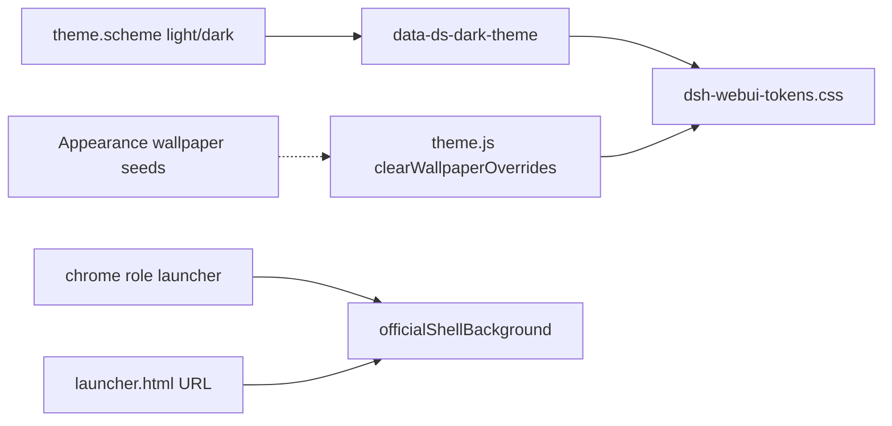

# Launcher official light/dark Implementation Plan

> **For agentic workers:** REQUIRED SUB-SKILL: Use superpowers:subagent-driven-development (recommended) or superpowers:executing-plans to implement this plan task-by-task. Steps use checkbox (`- [x]`) syntax for tracking.

**Goal:** Keep the cold-start launcher on the official dsh web light and dark tables (`data-ds-dark-theme`), never Appearance wallpaper seeds, with contract tests and QA that lock that split.

**Architecture:** Scheme still comes from Appearance / system (`theme.scheme`). `html[data-shell-theme=official]` makes `theme.js` set `data-ds-dark-theme` then clear wallpaper `--dsw-alias-*` overrides. Main-process window chrome uses `officialShellBackground` (`#FFFFFF` / `#151517`) for launcher role or `launcher.html` URL. Feature CSS stays tokens-only; `--boot-*` stays on the boot canvas.

**Tech Stack:** Electron main + renderer; Node `node:test`; official tables in `src/shared/dsh-webui-tokens.css`.

**Spec:** Product card [desktop-launcher.md](../../features/desktop-launcher.md) (invariants already state official light/dark). Design language [design-language.md](../../design-language.md). Ardot file `718011962003356` (Light `2:*` / Dark `4:*`) is the visual source; it is not in this repo.

## Global Constraints

- Touching: `desktop-launcher`. Keep the diff inside that card’s Allowed touch (this plan expands Allowed touch to `theme.js`, `chrome.js`, `src/shared/themes.js`).
- Same Electron process; live launcher HTML IDs and `window.shell` launcher methods stay working.
- Do not paint Appearance wallpaper family hex onto `--dsw-alias-*` on the launcher.
- Do not add `[data-theme]` / `prefers-color-scheme` branches in `launcher.css`.
- `--boot-*` / `data-boot-theme` stay off the launcher.
- Hex is allowed in main-process `backgroundColor` via `officialShellBackground`; not in feature CSS. Window-controls close hover `#e81123` is the known exception and lives in `window-controls.css`, not `launcher.css`.
- `theme.js` wallpaper overrides remain for non-official, non-boot shells.
- Do not undraft GitHub 0.2.7. Do not open marketplace / wallpaper gallery / full official Settings in the launcher.
- Stay on this checkout (uncommitted launcher theme work is already here). Do not create a new git worktree.
- Do not commit unless the user asks. Commit subject if later asked: `feature(desktop-launcher): official light/dark without wallpaper seeds`.

## Already landed (do not redo)

Product + Ardot from the prior session. Verify, then only add the missing helper, tests, and docs.

| Area | Files |
| --- | --- |
| Official shell flag | `src/renderer/launcher.html` `data-shell-theme="official"`; loads `dsh-webui-tokens.css` + `theme.js`; no `data-boot-theme` |
| Skip wallpaper seeds | `src/renderer/theme.js` `isOfficialShell()` + `clearWallpaperOverrides()` |
| Official canvas hex | `src/shared/themes.js` `officialShellBackground(theme)` → `#FFFFFF` / `#151517` |
| Window chrome | `src/main/chrome.js` `chromeBackgroundFor` + `attachIntegratedChrome(win, { role })`; `src/main/window.js` `createLauncherWindow` uses `officialShellBackground` + `role: 'launcher'` |
| Feature CSS | `src/renderer/launcher.css` tokens only |
| Card + rule | `docs/features/desktop-launcher.md` invariant; `.cursor/rules/desktop-launcher-product.mdc` |
| Ardot | Light `2:20`…`2:165`, Dark `4:1`…`4:168` on file `718011962003356` |

`officialShellBackground` already has a unit test in `src/shared/themes.test.js`. Keep it.

## File map

- Modify: `src/shared/themes.js` — add `usesOfficialShellChrome(role, url)` and `windowBackgroundForShell(theme, { role, url })`
- Modify: `src/shared/themes.test.js` — tests for that helper
- Modify: `src/main/chrome.js` — `chromeBackgroundFor` delegates to `windowBackgroundForShell`
- Create: `src/renderer/launcher-theme.test.js` — HTML / CSS / `theme.js` source + vm contract
- Modify: `docs/qa/production-acceptance-test-cases.md` — `TC-LAUNCH-007`
- Modify: `docs/features/desktop-launcher.md` — Allowed touch, gates, last verified
- Modify: `docs/features/README.md` — QA column
- Modify: `docs/handbook/modules/boot-lifecycle.md`, `docs/handbook/flows/boot-to-ready.md`
- Modify: `docs/design-language.md` — short 桌面启动器 section

Do not edit `vendor/deepseek-harness`. Do not edit `src/renderer/boot-tokens.css`.



---

### Task 1: Pure chrome background helper

**Files:**
- Modify: `src/shared/themes.js`
- Modify: `src/shared/themes.test.js`
- Modify: `src/main/chrome.js`

**Interfaces:**
- Consumes: existing `officialShellBackground(theme = {})` → `'#FFFFFF'` when `theme.scheme !== 'dark'`, else `'#151517'`
- Produces: `usesOfficialShellChrome(role, url)` boolean; `windowBackgroundForShell(theme, { role, url } = {})` hex string

- [x] **Step 1: Write the failing tests**

Append to `src/shared/themes.test.js` (keep the existing `officialShellBackground` test):

```js
const {
  parseSimpleYaml,
  resolveTheme,
  officialShellBackground,
  usesOfficialShellChrome,
  windowBackgroundForShell,
  FAMILY_SEEDS,
  listThemes,
} = require('./themes');

test('usesOfficialShellChrome is true for launcher role or launcher.html URL', () => {
  assert.equal(usesOfficialShellChrome('launcher', ''), true);
  assert.equal(usesOfficialShellChrome(undefined, 'file:///app/src/renderer/launcher.html'), true);
  assert.equal(usesOfficialShellChrome(undefined, 'file:///app/src/renderer/launcher.html?x=1'), true);
  assert.equal(usesOfficialShellChrome(undefined, 'file:///app/src/renderer/boot.html'), false);
  assert.equal(usesOfficialShellChrome('main', 'https://127.0.0.1:8080/'), false);
});

test('windowBackgroundForShell uses official canvas on launcher, wallpaper seed elsewhere', () => {
  const paper = { scheme: 'light', bg: '#f3efe6' };
  const grove = { scheme: 'dark', bg: '#14100b' };
  assert.equal(windowBackgroundForShell(paper, { role: 'launcher' }), '#FFFFFF');
  assert.equal(windowBackgroundForShell(grove, { url: 'file:///x/launcher.html' }), '#151517');
  assert.equal(windowBackgroundForShell(paper, { url: 'file:///x/boot.html' }), '#f3efe6');
  assert.equal(windowBackgroundForShell(grove, { role: 'main' }), '#14100b');
});
```

- [x] **Step 2: Run tests to verify they fail**

Run: `node --test src/shared/themes.test.js`

Expected: FAIL — `usesOfficialShellChrome` / `windowBackgroundForShell` not exported.

- [x] **Step 3: Minimal implementation**

In `src/shared/themes.js`, next to `officialShellBackground`:

```js
function usesOfficialShellChrome(role, url) {
  return role === 'launcher' || /launcher\.html(?:[?#]|$)/i.test(String(url || ''));
}

function windowBackgroundForShell(theme = {}, { role, url } = {}) {
  return usesOfficialShellChrome(role, url) ? officialShellBackground(theme) : theme.bg;
}
```

Export both from `module.exports`.

In `src/main/chrome.js`, require `windowBackgroundForShell` and replace `chromeBackgroundFor` with:

```js
function chromeBackgroundFor(win, theme = currentTheme()) {
  const role = chromeRoles.get(win);
  let url;
  try {
    url = win.webContents.getURL();
  } catch {
    // window already gone; role from WeakMap is still enough for the launcher
  }
  return windowBackgroundForShell(theme, { role, url });
}
```

Keep `isLauncherUrl` only if another caller still needs it; otherwise delete it so chrome does not duplicate the regex.

- [x] **Step 4: Run tests to verify they pass**

Run: `node --test src/shared/themes.test.js`

Expected: PASS (including the existing wallpaper-seed `officialShellBackground` cases).

- [x] **Step 5: Commit**

Skip unless the user asks.

---

### Task 2: Launcher HTML / CSS / theme.js contract tests

**Files:**
- Create: `src/renderer/launcher-theme.test.js`

**Interfaces:**
- Consumes: `window.applyShellTheme` after evaluating `theme.js` in a vm; `data-shell-theme="official"` on `launcher.html`
- Produces: automated gate that wallpaper seeds do not stick on the official shell

- [x] **Step 1: Write the failing tests**

Create `src/renderer/launcher-theme.test.js`:

```js
const test = require('node:test');
const assert = require('node:assert/strict');
const fs = require('node:fs');
const path = require('node:path');
const vm = require('node:vm');

const rendererDir = __dirname;
const html = fs.readFileSync(path.join(rendererDir, 'launcher.html'), 'utf8');
const css = fs.readFileSync(path.join(rendererDir, 'launcher.css'), 'utf8');
const themeSrc = fs.readFileSync(path.join(rendererDir, 'theme.js'), 'utf8');

test('launcher.html is an official shell, not the boot canvas', () => {
  assert.match(html, /data-shell-theme="official"/);
  assert.match(html, /dsh-webui-tokens\.css/);
  assert.match(html, /src="theme\.js"/);
  assert.doesNotMatch(html, /data-boot-theme/);
  assert.doesNotMatch(html, /boot-tokens\.css/);
});

test('launcher.css uses official tokens with no second palette', () => {
  assert.match(css, /var\(--dsw-alias-bg-base\)/);
  assert.doesNotMatch(css, /#[0-9a-fA-F]{3,8}/);
  assert.doesNotMatch(css, /prefers-color-scheme/);
  assert.doesNotMatch(css, /\[data-theme\]/);
  assert.doesNotMatch(css, /--boot-/);
});

function loadApplyTheme(htmlAttrs) {
  const attrs = { ...htmlAttrs };
  const rootVars = new Map();
  const bodyVars = new Map();
  const document = {
    documentElement: {
      getAttribute: (name) => (Object.prototype.hasOwnProperty.call(attrs, name) ? attrs[name] : null),
      hasAttribute: (name) => Object.prototype.hasOwnProperty.call(attrs, name),
      toggleAttribute(name, on) {
        if (on) attrs[name] = '';
        else delete attrs[name];
      },
      style: {
        setProperty(name, value) { rootVars.set(name, value); },
        removeProperty(name) { rootVars.delete(name); },
        colorScheme: '',
      },
    },
    body: {
      toggleAttribute() {},
      style: {
        setProperty(name, value) { bodyVars.set(name, value); },
        removeProperty(name) { bodyVars.delete(name); },
      },
    },
  };
  const sandbox = { document, window: {}, console };
  vm.runInNewContext(`${themeSrc}\nthis.applyTheme = applyTheme;`, sandbox);
  return { applyTheme: sandbox.applyTheme, rootVars, bodyVars, attrs };
}

test('theme.js clears wallpaper seeds on official shells and still sets dark attribute', () => {
  const { applyTheme, rootVars, bodyVars, attrs } = loadApplyTheme({ 'data-shell-theme': 'official' });
  applyTheme({
    scheme: 'dark',
    bg: '#14100b',
    fg: '#e7f6f1',
    muted: '#8a9a94',
    accent: '#3dd6b5',
    line: '#2a3a34',
  });
  assert.ok(Object.prototype.hasOwnProperty.call(attrs, 'data-ds-dark-theme'));
  assert.equal(rootVars.get('--dsw-alias-bg-base'), undefined);
  assert.equal(bodyVars.get('background'), undefined);
});

test('theme.js still paints wallpaper seeds on ordinary shells', () => {
  const { applyTheme, rootVars } = loadApplyTheme({});
  applyTheme({ scheme: 'light', bg: '#f3efe6', fg: '#1a1714' });
  assert.equal(rootVars.get('--dsw-alias-bg-base'), '#f3efe6');
});
```

- [x] **Step 2: Run test to verify it fails**

Run: `node --test src/renderer/launcher-theme.test.js`

Expected: FAIL only if HTML/CSS/`theme.js` drifted. If the prior session already landed those files, this step may PASS on first run — that is acceptable; do not weaken assertions.

- [x] **Step 3: Fix product code only if a test fails**

Do not add hex or `prefers-color-scheme` to `launcher.css`. If `theme.js` vm fails, keep `isOfficialShell()` as `getAttribute('data-shell-theme') === 'official'` and `clearWallpaperOverrides` removing the seven `--dsw-alias-*` names listed in the current file.

- [x] **Step 4: Run tests to verify they pass**

Run: `node --test src/renderer/launcher-theme.test.js src/shared/themes.test.js`

Expected: PASS.

- [x] **Step 5: Commit**

Skip unless the user asks.

---

### Task 3: QA, Allowed touch, handbook, design language

**Files:**
- Modify: `docs/qa/production-acceptance-test-cases.md` (after `TC-LAUNCH-006`)
- Modify: `docs/features/desktop-launcher.md`
- Modify: `docs/features/README.md`
- Modify: `docs/handbook/modules/boot-lifecycle.md`
- Modify: `docs/handbook/flows/boot-to-ready.md`
- Modify: `docs/design-language.md`

**Interfaces:**
- Consumes: Task 1–2 behavior (official canvas, no wallpaper tint)
- Produces: `TC-LAUNCH-007`; card Allowed touch includes `theme.js` / `chrome.js` / `src/shared/themes.js`

- [x] **Step 1: Add TC-LAUNCH-007**

Insert after `TC-LAUNCH-006`:

```markdown
### TC-LAUNCH-007 · 启动器浅色/深色跟官方表，不跟壁纸种子 · P0

**前置：** Appearance 已选一套非默认壁纸家族（浅色与深色半的 `background` 都不是官方 `#FFFFFF` / `#151517`）。

**步骤：**

1. 外观切浅色，冷启动（或托盘「打开启动器」）。
2. 外观切深色，再打开启动器。

**期望：** 启动器画布是官方浅色白底 / 深色 `#151517` 近黑，侧栏与主按钮跟官方 dsh web 设置壳，不是壁纸家族色。桌面主界面仍可跟 Appearance 壁纸。启动器没有仪器画布、没有 `--boot-*`。
```

- [x] **Step 2: Update the feature card**

`docs/features/desktop-launcher.md`:

- `last verified`: `2026-08-23 — 启动器官方浅色/深色表，不跟 Appearance 壁纸种子`
- Allowed touch: add `src/renderer/theme.js`、`src/main/chrome.js`、`src/shared/themes.js`
- Gates Manual / QA: `TC-LAUNCH-001`…`007`
- Automated: add `launcher-theme` / `officialShellBackground` / `windowBackgroundForShell`

`docs/features/README.md` desktop-launcher row QA column: `TC-LAUNCH-001…007`

- [x] **Step 3: Handbook + design language**

In `docs/handbook/modules/boot-lifecycle.md` 不变量, after the `--dsw-alias-*` line, add:

`启动器浅色/深色跟官方 dsh web 表（data-ds-dark-theme），不把 Appearance 壁纸种子写进 token。`

QA line: `TC-LAUNCH-001` … `TC-LAUNCH-007`.

Same QA bump in `docs/handbook/flows/boot-to-ready.md`.

In `docs/design-language.md`, after `## 桌面启动页` (do not merge launcher into the boot canvas section), add:

```markdown
## 桌面启动器

启动器是冷启动闸门窗，不是仪器画布。源文件是 [`launcher.html`](../src/renderer/launcher.html)、[`launcher.css`](../src/renderer/launcher.css)、[`launcher.js`](../src/renderer/launcher.js)。色表是 [`dsh-webui-tokens.css`](../src/shared/dsh-webui-tokens.css) 的官方浅色 `:root` 与深色 `html[data-ds-dark-theme]`。`html[data-shell-theme=official]` 让 [`theme.js`](../src/renderer/theme.js) 只切 `theme.scheme` 的明暗半，不把 Appearance 壁纸种子写进 `--dsw-alias-*`。禁止 `--boot-*`、`data-boot-theme`，也禁止在 `launcher.css` 里写第二套 `[data-theme]` / `prefers-color-scheme` 色板。
```

Link that heading from 现有偏差 if it still says only the boot canvas is the documented exception — launcher is official language, not a second exception.

- [x] **Step 4: Run the focused suite**

Run: `node --test src/renderer/launcher-theme.test.js src/shared/themes.test.js`

Expected: PASS.

- [x] **Step 5: Commit**

Skip unless the user asks.

---

## Spec coverage

| Requirement | Task |
| --- | --- |
| Official light/dark tables, `data-ds-dark-theme` | Already landed; Task 2 vm + HTML |
| No wallpaper seeds on launcher tokens | Task 1 helper + Task 2 vm |
| No `--boot-*` on launcher | Task 2 CSS/HTML |
| Main-process window bg official hex | Task 1 `windowBackgroundForShell` |
| Manual Appearance light vs dark | Task 3 `TC-LAUNCH-007` |
| Allowed touch includes theme/chrome/themes.js | Task 3 |
| Ardot light + dark frames | Already landed out of repo |

## Self-review

- No placeholders. Commit steps are explicit skips unless the user asks.
- Names: `usesOfficialShellChrome`, `windowBackgroundForShell`, `TC-LAUNCH-007`, `data-shell-theme="official"`.
- `isLauncherUrl` in chrome.js is replaced by the shared helper so the regex has one home.
