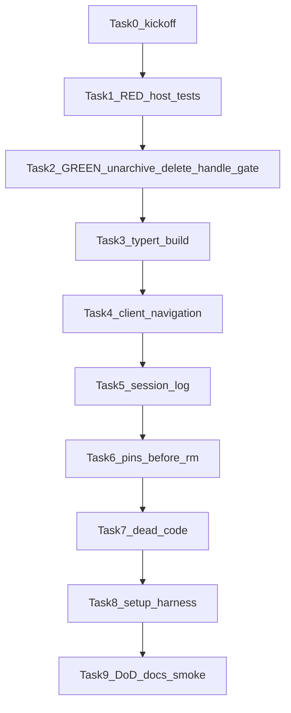

# 合树后收口 Implementation Plan

> **For agentic workers:** REQUIRED SUB-SKILL: Use superpowers:executing-plans（本任务单会话、按 Task 顺序）。每步 checkbox。**TDD：没有先看红的测试，不准写生产代码。** 用户规则：不自动 commit，除非 Trent 明确要求。

**Goal:** 合树 pin `dsh-v0.1.2-alpha.1` 之后，把桌面产品洞收口到 leftover 合同：已归档可恢复、打开过再归档也能删干净、会话日志只在标题栏、钉版门禁为真绿。

**Architecture:** 不复活 apiproxy。`workspace.unarchiveSession` 与 `session.delete` 走 Typert `@Remote`。SessionController 包住 `ctx.agents.create/resume` 保留 `AgentHandle`，删除时 `handle.dispose()`。`sessionDeleteGate` 挂在 `ctx` 上，archive **和** unarchive 都要查。客户端 unary 成功后 `applyDeleted` + 归档回声；确认框仍看归档集。

**Tech Stack:** vendor Cordis + Typert Remote；vitest（vendor 包）+ node:test（桌面门禁）；`npm run setup:harness` = vendor `pnpm install --frozen-lockfile` + `pnpm run build`。

**Spec / 卡:**
- [`docs/features/session-archive.md`](docs/features/session-archive.md)
- leftover 删除源：[`vendor/deepseek-harness/packages/host/apiproxy/src/api-proxy.ts`](vendor/deepseek-harness/packages/host/apiproxy/src/api-proxy.ts)（helpers ~1061–1222，delete ~2778–2901，mutex ~3175–3206）
- leftover 测：[`api-proxy-session-delete.spec.ts`](vendor/deepseek-harness/packages/host/apiproxy/tests/api-proxy-session-delete.spec.ts)
- leftover 客户端 applyDeleted：[`client/runtime/.../manager.ts`](vendor/deepseek-harness/packages/client/runtime/src/client/sessions/manager.ts) ~658

## Global Constraints

- Touching 开场：`session-archive, message-edit, desktop-launcher`（钉版还碰 wallpaper/usage-stats/surfaces/terminal/transparent/settings-select 的路径钉，不改那些卡的 Invariants）。
- 打开过再归档必须能删（A）。禁止降级成「只删冷 persist」。
- session-archive Invariants **只改事件名**：`host/session-deleted*` 与半成功条里的 `session-deleted` → `api-session/removed`。禁止双发旧帧。
- 禁止：Setup、rc.2、并入 `wip/remote-pairing-ensure`、整包复活/删除 apiproxy 或 client/runtime、自动 commit、`git sync --abort`。
- 禁止：`workspace.delete` 当会话删除；`ctx.agents.get` 当 dispose；`as any` 糊弄未生成的 Remote。
- conversation 与 ui-chat 的 `apply.ts` 都挂。禁止把 leftover `registerChatNodeRenderers` 接回 conversation。
- 桌面 lock 禁止手改；只允许 `npm run setup:harness` 重生 vendor lock。
- 官方视觉：tokens / ui-primitives；不发明第二套皮。

## 降级黑名单（出现即本计划失败）

- 不保留 AgentHandle，或只 wrap `createOrAdopt`/`resumeObserved` 而漏掉 `ctx.agents.create/resume`。
- 跳过 `session-live-unowned`。
- 互斥只挡 unarchive、不挡 archive。
- gate 只活在 session-controller 私有 Set，workspace-controller 看不见。
- 删除成功只走 `handleSessionRemoved` 而不 `applyDeleted`。
- RPC ok 立刻关确认框，不等归档集去掉该 id。
- 会话日志双挂 header + titlebar。
- 删 StatsLine 钉，或钉仍指向 conversation 残留文件。
- leftover 删除用例 skip / 删减 / 不断言 `api-session/removed` 顺序。
- 宣称完成但三条冒烟少一条。

## 文件地图

| 责任 | 路径 |
| --- | --- |
| 删除门闩 | 新建 `vendor/deepseek-harness/packages/api/session-controller/src/delete-gate.ts`（provide 到 ctx） |
| 删除实现 | 新建 `vendor/deepseek-harness/packages/api/session-controller/src/delete.ts`（从 apiproxy 搬 helpers + delete） |
| Handle 保留 | [`session-controller/src/agent.ts`](vendor/deepseek-harness/packages/api/session-controller/src/agent.ts) 或 [`index.ts`](vendor/deepseek-harness/packages/api/session-controller/src/index.ts) 构造函数 wrap `ctx.agents.create/resume` |
| session.delete Remote | [`session-controller/src/index.ts`](vendor/deepseek-harness/packages/api/session-controller/src/index.ts) `@Remote('delete')` |
| 错误/请求类型 | [`session-controller/src/types.ts`](vendor/deepseek-harness/packages/api/session-controller/src/types.ts) |
| unarchive + 查 gate | [`workspace-controller/src/commands.ts`](vendor/deepseek-harness/packages/api/workspace-controller/src/commands.ts) + [`index.ts`](vendor/deepseek-harness/packages/api/workspace-controller/src/index.ts) |
| workspace 错误码 | [`workspace-controller/src/types.ts`](vendor/deepseek-harness/packages/api/workspace-controller/src/types.ts) `session-delete-in-progress` |
| Client workspace | [`service.ts`](vendor/deepseek-harness/packages/api/workspace-controller/src/client/service.ts) `unarchiveSession` + `echoArchived` |
| Client sessions | [`contract/sessions.ts`](vendor/deepseek-harness/packages/api/session-controller/src/client/contract/sessions.ts) + [`service.ts`](vendor/deepseek-harness/packages/api/session-controller/src/client/sessions/service.ts) + [`manager.ts`](vendor/deepseek-harness/packages/api/session-controller/src/client/sessions/manager.ts) `applyDeleted` |
| 导航 | [`ui-workspace/.../navigation.ts`](vendor/deepseek-harness/packages/client/ui-workspace/src/client/navigation.ts) |
| 确认框（只读，勿改关窗条件） | [`rows/WorkspaceBrowser.tsx`](vendor/deepseek-harness/packages/client/ui-workspace/src/client/rows/WorkspaceBrowser.tsx) ~1218 |
| 会话日志 | [`session-log-export/src/client/index.ts`](vendor/deepseek-harness/packages/session-query/session-log-export/src/client/index.ts) |
| store 类型 | [`SessionLogChromeRow.tsx`](vendor/deepseek-harness/packages/session-query/session-log-export/src/client/SessionLogChromeRow.tsx) + [`chrome-visibility.ts`](vendor/deepseek-harness/packages/session-query/session-log-export/src/client/chrome-visibility.ts) |
| 钉 | [`harness-desktop-forks.js`](src/shared/harness-desktop-forks.js) [`post-merge-ui.test.js`](src/shared/post-merge-ui.test.js) [`after-pack.js`](scripts/after-pack.js) |
| 卡 | [`docs/features/session-archive.md`](docs/features/session-archive.md) [`message-edit.md`](docs/features/message-edit.md) README |

Host 单测可直接调 controller 方法，**不依赖** generated remote。Client / Fake 必须等 `pnpm run build`（或该包 `bundle`）写出 `lib/typert.remote-client.d.ts`。



---

## Task 0 — Kickoff（不写功能代码）

- [ ] 会话开头声明 Touching / Goal / Do not / Gate（见 [`docs/features/README.md`](docs/features/README.md)）。
- [ ] 确认 pin：`vendor/harness-upstream.json` 为 `dsh-v0.1.2-alpha.1` / `cd5ef8148158c3a752a658978873241fdf8e2bbc`。
- [ ] 确认 leftover 源还在：`apiproxy/src/api-proxy.ts` 仍有 `collectDeletable`、`deletingIds`、`sessions.delete`。没有则停，不要自己发明另一套级联规则。
- [ ] 确认 `navigation.ts` 仍 throw。这是本 Task 1 的红起点。

**完成标准：** 上述文件能打开；未改业务代码。

---

## Task 1 — 类型 + Host 测试先红（TDD）

**不准**先写 `@Remote` 实现。

### 1.1 错误与 DTO（可与测试同一提交逻辑块，但测试先红）

在 [`session-controller/src/types.ts`](vendor/deepseek-harness/packages/api/session-controller/src/types.ts) 增加（实现可稍后，测试 import 会红）：

```ts
export interface SessionDeleteRequest {
  readonly sessionId: SessionId
}
export interface SessionDeleteValue {
  readonly deletedSessionIds: readonly SessionId[]
  readonly archivedSessionIds: readonly SessionId[]
}
```

`SessionErrorDetailsMap` 增加：

- `'session-not-archived': { readonly sessionId: SessionId }`
- `'session-running': { readonly sessionId: SessionId }`
- `'session-live-unowned': { readonly sessionId: SessionId }`
- `'session-delete-partial': { readonly sessionId: SessionId; readonly deletedSessionIds: readonly SessionId[]; readonly cause: string }`
- `'session-delete-incomplete': { readonly sessionId: SessionId; readonly deletedSessionIds: readonly SessionId[] }`

[`workspace-controller/src/types.ts`](vendor/deepseek-harness/packages/api/workspace-controller/src/types.ts) 增加 `'session-delete-in-progress': { readonly sessionId: SessionId }`。

`WorkspaceArchiveSessionRequest` 已存在；unarchive 用同一请求形状 `{ sessionId }`，返回已有 `WorkspaceArchiveValue`。

### 1.2 把 leftover 删除 spec 迁成失败测试

新建 `vendor/deepseek-harness/packages/api/session-controller/tests/session-delete.host.spec.ts`。

- 复制 leftover 用例意图，**不要 skip**。
- harness 对齐 leftover：MemorySessionPersistence、WorkspaceRegistry、AgentFactory create/resume **返回带 dispose 的 handle**（SessionController wrap 之后才能绿；本步先红）。
- 调用 `controller.delete({ sessionId })`（Typert 把失败变成 throw `TypertRemoteFailure`，断言 `failure.code`，不要 leftover 的 `result.ok`）。
- 事件：`ctx.on('api-session/removed', ...)`。成功路径：**每个 gone id 都要收到**，且 **第一条 removed 早于**归档集不再包含 root。禁止断言 `host/session-deleted`。
- 必须包含 leftover 这些场景（名字可改，语义不许少）：

  1. 未归档已知会话 → `session-not-archived`，persist 仍在
  2. 幽灵 id → `session-not-found`
  3. running → `session-running`，什么都不删
  4. 嵌套 subagent 删掉，fork 与 `origin:'dshbot'` 留下
  5. `ctx.agents.resume` 后的 idle 活 owner 能删，之后 `agents.get` 为空
  6. 只 `agents.register`、无 handle → `session-live-unowned`
  7. persist 已 gone 仍 unarchive 成功
  8. persist.delete EPERM 且仍 listed → 不 unarchive、无 `api-session/removed`
  9. 子 gone 根 EPERM → `session-delete-partial`
  10. `agents.create` 的活 subagent 随根消失
  11. delete 持锁时 unarchive → `session-delete-in-progress`
  12. **archive 在 delete 持锁时同样** `session-delete-in-progress`
  13. 无 persist+live 的归档幽灵在成功路径被 prune

### 1.3 workspace unarchive 测试先红

扩 [`workspace-controller.host.spec.ts`](vendor/deepseek-harness/packages/api/workspace-controller/tests/workspace-controller.host.spec.ts)：archive 后再 `unarchiveSession` → `archivedSessionIds` 为空；未知 id → `session-not-found`。

- [ ] 跑红：在 `vendor/deepseek-harness` 下  
  `pnpm exec vitest run packages/api/session-controller/tests/session-delete.host.spec.ts packages/api/workspace-controller/tests/workspace-controller.host.spec.ts`
- [ ] 确认红因是 **方法不存在 / 错误码不对**，不是 harness 写崩。

**完成标准：** 测试文件已提交到工作区；实现仍缺；命令红。

---

## Task 2 — Host 变绿（仍不改 Client UI）

顺序固定，每步跑 Task 1 的 vitest。

### 2.1 `sessionDeleteGate`

新建 `delete-gate.ts`：`Set<SessionId>`；`has` / `add` / `remove`。SessionController 构造里 `ctx.provide('sessionDeleteGate', gate)`。

WorkspaceCommands `inject` 增加该服务（或 `ctx.get` + 缺失当「无删除进行中」，**禁止**缺失时静默放过——SessionController 必在 Host 上；单测 workspace harness 要 `provide` 假 gate）。

`archiveSession` 与 `unarchiveSession` **开头**都 `if (gate.has(sessionId))` → `TypertRemoteFailure` `session-delete-in-progress`。

### 2.2 unarchive Remote

`commands.unarchiveSession`：先 gate，再 `workspaceRegistry.unarchiveSession`，`WorkspaceUnknownSessionError` → `session-not-found`，返回 `{ archivedSessionIds: [...registry.archivedSessionIds] }`。

`index.ts`：`@Remote('unarchiveSession')`。

### 2.3 搬 delete helpers + `delete.ts`

从 leftover **逐函数搬** `collectDeletable` / `persistDeleteOrder` / `persistDeleteOrResume` / `pruneMissingArchived`，注释保留「fork/dshbot 不跟」。不要重写级联规则。

`deleteArchivedSession(ctx, request)`：

1. 组 headers：persist.list + `ctx.sessions.list()`。
2. 不在 headers 且不在归档 → `session-not-found`。
3. 根不在归档 → `session-not-archived`。
4. deletable 中 running → `session-running`。
5. `agents.get` 有值且 gate 地图无 handle → `session-live-unowned`。
6. `gate.add(deletable)`；try/finally `remove`。
7. 再读归档集，根已不在 → `session-not-archived`（竞态）。
8. 按 order：`handle.dispose()`（有则）、`persistDeleteOrResume`；成功进 `gone`。
9. **每个 gone：`ctx.emit('api-session/removed', id)`**。不要发 `host/session-deleted`。
10. 根在 gone：`unarchiveSession(root)` + 所有 workspace `detachSession(gone)`；registry 失败 → `session-delete-incomplete`。
11. 根不在 gone：detach 已 gone 的；`session-delete-partial`。
12. `pruneMissingArchived`。
13. 全成功返回 `{ deletedSessionIds: ordered, archivedSessionIds }`。

### 2.4 包住 create/resume

Leftover ~1166–1202。在 SessionController（或 AgentController 构造尽早）保存 `nativeCreate`/`nativeResume`，wrap 后 `retainHandle`。同一 agent 不二次 wrap。dispose finally 从 map 删除。

**禁止**只改 `return (await this.ctx.agents.resume(...)).agent` 而不 wrap 全局 `ctx.agents.create`。

### 2.5 `@Remote('delete')`

`index.ts` 委托 `delete.ts`。`test-remote.ts` 的 `TestSessionRemote` / `createSessionTestRemote` 加 `delete`。

- [ ] 再跑 Task 1 vitest，必须全绿。
- [ ] 抽查：无 handle 的 register 用例仍是 `session-live-unowned`，不是 ok。

**完成标准：** Host 删除合同与 leftover 一致（事件名除外）；Client 仍 throw。

---

## Task 3 — 代码生成（Client 类型的前提）

- [ ] 在 vendor：`pnpm run build`（或至少 workspace-controller + session-controller 的 `bundle`）。`setup:harness` 也会 build，但本步可先局部 build 以加快循环。
- [ ] 打开 `packages/api/workspace-controller/lib/typert.remote-client.d.ts` 确认有 `unarchiveSession`。
- [ ] 打开 `packages/api/session-controller/lib/typert.remote-client.d.ts` 确认 `session` 命名空间有 `delete`。
- [ ] **没有这两份生成物不准改 FakeWorkspaceRemote / ClientSessions。**

---

## Task 4 — Client + 导航（TDD）

### 4.1 workspace client

先改 Fake/Command remotes 加 `unarchiveSession`（没有 generated 类型会编不过 → 回到 Task 3）。

[`model.client.spec.ts`](vendor/deepseek-harness/packages/api/workspace-controller/tests/model.client.spec.ts)：先写 unarchive 成功装 `archivedSessionIds`、失败不改快照；跑红；再实现 `ClientWorkspaceModel.unarchiveSession`（照抄 `archiveSession` + `installArchived`）。

`IWorkspaces`：

- `unarchiveSession(sessionId): Promise<void>`
- `echoArchived(archivedSessionIds: readonly SessionId[]): void`（内部 `model.replaceArchived`）

transport spec 的 `CommandWorkspaceRemote` 同步加方法。

### 4.2 session client `applyDeleted`

Leftover 语义：`recordMutation({ kind: 'remove', sessionId })` + `handleRemoved` + 清 queues/jobs/projections/addresses。

**不要**复用 `handleSessionRemoved`（durable subagent 只清 running）。

TDD：在 [`manager.client.spec.ts`](vendor/deepseek-harness/packages/api/session-controller/tests/manager.client.spec.ts) 加：列表里有 `origin:'subagent'` 的行，`applyDeleted` 后 items **不含**该 id。先红，再实现。

`ISessions.deleteSession(sessionId): Promise<{ deletedSessionIds; archivedSessionIds }>`：

1. `remote.session.delete({ sessionId })`
2. 失败 throw（带 `code`）
3. 成功：每个 deleted id `manager.applyDeleted`；`projectList()`
4. 返回 value 给 UiWorkspace 去 `echoArchived`

### 4.3 navigation

[`navigation.ts`](vendor/deepseek-harness/packages/client/ui-workspace/src/client/navigation.ts)：

```ts
async unarchiveSession(sessionId: SessionId): Promise<void> {
  await this.workspaces.unarchiveSession(sessionId)
}
async deleteSession(sessionId: SessionId): Promise<void> {
  const result = await this.sessions.deleteSession(sessionId)
  this.workspaces.echoArchived(result.archivedSessionIds)
}
```

禁止 `sessions.open` 在 unarchive 里。

[`rows.client.spec.tsx`](vendor/deepseek-harness/packages/client/ui-workspace/tests/rows.client.spec.tsx) 已有「菜单是 unarchive + danger delete」。再加：stub `unarchiveSession`/`deleteSession` 被菜单路径调用（按现有 inject 方式）。**禁止**再期望 throw。

确认框：读 `rows/WorkspaceBrowser.tsx` 里 `sessionDeleteCommittedId` 与 `archivedSessionIds.includes` —— **不要改成 RPC resolve 就 close**。

- [ ] `pnpm exec vitest run packages/api/workspace-controller packages/api/session-controller packages/client/ui-workspace`

**完成标准：** navigation 无 throw；删除成功后归档回声能关掉确认框；subagent 行被 `applyDeleted` 摘掉。

---

## Task 5 — 会话日志回标题栏（TDD）

现存 leftover [`client-apply.client.spec.tsx`](vendor/deepseek-harness/packages/session-query/session-log-export/tests/client-apply.client.spec.tsx) **已经**期望 titlebar。先跑：

`pnpm exec vitest run packages/session-query/session-log-export/tests/client-apply.client.spec.tsx`

预期红（活代码挂 header.utilities，inject 也不对）。

然后实现：

- [`index.ts`](vendor/deepseek-harness/packages/session-query/session-log-export/src/client/index.ts)：`shell.titlebar.trailing` + `settings.interface.item`；**删除** `conversation.session.header.utilities`。
- `inject` 对齐 spec：`['slots','locale','connection','remote','settingsScope']`。
- `SessionLogChromeRow.tsx` 与 `chrome-visibility.ts`：`@deepseek-ai/dsh-client-runtime/client` → `@deepseek-ai/dsh-client-store`（`createSnapshotStore` / `SnapshotStore` / `SettingsScope` 以 store 包实际导出为准，不够就加 peer，禁止继续依赖 runtime）。
- header golden 排除 `button "Session log"` 已在 [`FORK_FILE_MARKERS`](src/shared/harness-desktop-forks.js)，不要删。

- [ ] 再跑该 spec 绿。

**完成标准：** 会话头 utilities 无 Session log；标题栏有；设置行能关。

---

## Task 6 — 抬版与路径钉（必须在 Task 7 删文件之前）

桌面仓库：

- [ ] 改 [`post-merge-ui.test.js`](src/shared/post-merge-ui.test.js) StatsLine `file` → `packages/client/ui-chat/src/client/chat/StatsLine.tsx`。
- [ ] 删或改指「InputBar mention drop」（InputBar 已无 MIME）；**保留** Files `composerMention.ts` 钉。
- [ ] 改 [`harness-desktop-forks.js`](src/shared/harness-desktop-forks.js) `FORK_FILE_MARKERS` StatsLine 路径同上。
- [ ] 改 [`harness-desktop-forks.test.js`](src/shared/harness-desktop-forks.test.js) fixture 路径 + `assertDesktopForks(vendor, '0.1.2-alpha.1')`。
- [ ] 17 个仍为 `0.1.1-rc.1` 的 `DESKTOP_PACKAGES` 的 `package.json` `version` → `0.1.2-alpha.1`。browse 一对已是 alpha.1，不要改错。**不要手改 pnpm-lock。**
- [ ] [`after-pack.js`](scripts/after-pack.js) `requiredFiles` 加 `node_modules/@deepseek-ai/dsh-client-ui-chat/lib/client.js`；`user-actions` 读 **ui-chat** 的 client.js。同步 [`after-pack.test.js`](src/main/after-pack.test.js)。

- [ ] 先跑红/绿：  
  `npx --yes node --test src/shared/post-merge-ui.test.js src/shared/harness-desktop-forks.test.js`  
  再  
  `node -e "require('./src/shared/harness-desktop-forks').assertDesktopForks(require('path').join('vendor','deepseek-harness'),'0.1.2-alpha.1')"`

**完成标准：** 钉指向活文件；17+2 包 version 均为 `0.1.2-alpha.1`。

---

## Task 7 — 死代码（钉已绿）

- [ ] `git rm` 旧 [`ui-workspace/src/client/WorkspaceBrowser.tsx`](vendor/deepseek-harness/packages/client/ui-workspace/src/client/WorkspaceBrowser.tsx) + 同目录 `WorkspaceBrowser.module.css`。确认没有任何 import（活入口 `rows/`）。
- [ ] `git rm` conversation `chat/StatsLine.tsx` + css。保留 [`settings/StatsLineRow.tsx`](vendor/deepseek-harness/packages/client/ui-conversation/src/client/settings/StatsLineRow.tsx)。
- [ ] `ChatView` / `MessageItem`：grep `apply.ts` 与其它 **非 test** 引用。`CommandNodeView` 用 `ChatView.module.css` → **保留 css**。仅当无生产引用且 spec 已迁/删后再 `git rm` 源文件。不准清空整个 `chat/`。
- [ ] **禁止** `git rm -r packages/host/apiproxy` 或 `packages/client/runtime`。

- [ ] 再跑 `assertDesktopForks` + post-merge-ui，确认删文件没有打掉钉。

---

## Task 8 — setup:harness + 合树残留

- [ ] 仓库根：`npm run setup:harness`（vendor frozen lock + `pnpm run build` + Ghostty）。失败则修原因，禁止手并 lock。
- [ ] `git worktree list` 看到 `.git/dsh-harness-sync-worktree` 则 `git worktree remove` 该路径。
- [ ] 删 `.git/dsh-harness-sync.json`。
- [ ] **禁止** `sync:harness --abort`。

---

## Task 9 — 验收、文档、Definition of Done

### 9.1 自动

在桌面根：

```powershell
node -e "require('./src/shared/harness-desktop-forks').assertDesktopForks(require('path').join('vendor','deepseek-harness'),'0.1.2-alpha.1')"
npx --yes node --test src/shared/post-merge-ui.test.js src/shared/harness-desktop-forks.test.js src/main/dsh.test.js
npm test
```

在 vendor：

```powershell
pnpm exec vitest run packages/api/workspace-controller packages/api/session-controller packages/session-query/session-log-export packages/client/ui-workspace
```

全量 `npm test`（桌面）失败 → 未完成。

### 9.2 冒烟（少一条 = 未完成）

1. 发一条消息 → 归档 → 已归档 ⋯ **取消归档**（主视图不自动打开）→ 再归档 → **删除** 确认：行消失、不闪回活列表、磁盘上工作区文件夹还在。
2. 标题栏有会话日志；会话头没有 Session log。
3. Task 6 的 assertDesktopForks / post-merge-ui 绿。

### 9.3 文档

- README：pin 改为 `0.1.2-alpha.1`；写清 **git tag ≠ npm**；未发布禁止 npx 兜底。
- [`session-archive.md`](docs/features/session-archive.md)：
  - Allowed touch → `packages/api/workspace-controller`、`packages/api/session-controller`、`packages/client/ui-workspace`（可保留 workspace registry）。去掉 apiproxy / client/runtime 作为主路径。
  - Gates：`session-delete.host.spec` + `pnpm exec vitest run` 上述包，不再写 apiproxy。
  - Invariants **只改两处事件名**为 `api-session/removed`。其它条目一字不动。
  - `last verified` 写今天日期 + 打开过再归档可删。
- [`message-edit.md`](docs/features/message-edit.md) Allowed touch → ui-chat `MessageItem` / `register-node-renderers`。Invariants 不动。刷 last verified。
- 其它卡只刷 last verified，不改 Invariants。

### Definition of Done（全勾才能说做完）

- [ ] `navigation.ts` 无 pin throw
- [ ] Host 删除 13 类用例绿；archive 与 unarchive 持锁都挡
- [ ] resume 后的 idle 会话能删；无 handle live → `session-live-unowned`
- [ ] 客户端 `applyDeleted` 能摘 subagent 行；确认框依赖归档回声
- [ ] 会话日志只在 titlebar
- [ ] 19 桌面包 version 均为 `0.1.2-alpha.1`
- [ ] StatsLine 钉在 ui-chat 且含 `data-stats-line`
- [ ] after-pack 要求 ui-chat
- [ ] setup:harness 成功；合树 worktree 与 sync json 已无
- [ ] 三条冒烟过
- [ ] 卡事件名已改；其它 Invariants 未动
- [ ] 未打 Setup；未 commit（除非 Trent 要求）

**本轮不做：** surfaces 空栏五卡片；双发旧 host 帧；整包删除 apiproxy/runtime。
