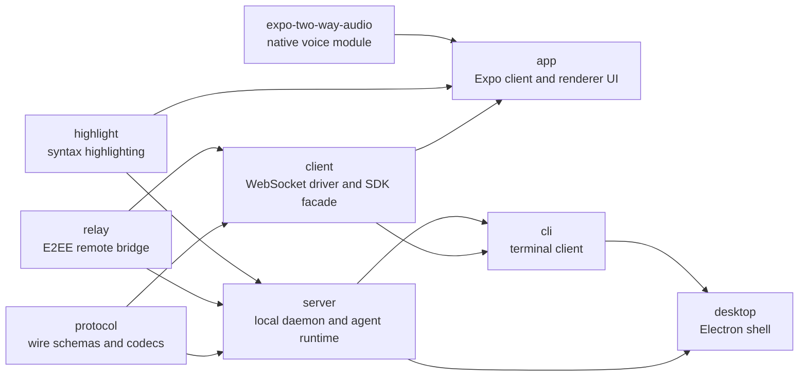

# Architecture Map

This document maps the repository into handoff-sized ownership units. It is intentionally higher-level than `docs/architecture.md`: use it to decide which agent should own a task and which other agents must coordinate.

## Module Layers



The dependency arrows above are generated from package manifests where available; verify with CI generator. The generated graph files contain the current workspace dependency edges discovered from package manifests and imports.

## Ownership Boundaries

| Module             | Owns                                                                            | Must Not Own                                            |
| ------------------ | ------------------------------------------------------------------------------- | ------------------------------------------------------- |
| protocol           | Wire schemas, protocol constants, binary frames, shared provider config schemas | Daemon runtime behavior, UI state                       |
| client             | Daemon transport, RPC correlation, SDK facade                                   | App layout, daemon storage                              |
| server             | Agent lifecycle, daemon sessions, providers, storage, MCP, relay transport      | Cross-platform UI, Electron shell UX                    |
| app                | React Native screens, host/session state, composer, settings, voice UX          | Daemon process ownership, protocol compatibility policy |
| cli                | Terminal UX and command routing                                                 | Long-lived daemon state semantics                       |
| desktop            | Electron main/preload, managed daemon startup, packaged desktop integration     | Generic app UI that must also run on mobile/web         |
| relay              | Encrypted transport and relay adapters                                          | Agent lifecycle semantics, UI decisions                 |
| highlight          | Reusable highlight output                                                       | App screen structure                                    |
| expo-two-way-audio | Native audio bridge                                                             | Voice product flow and session state                    |

## Coordination Boundaries

Use a coordinator agent when a change crosses one of these seams:

- Protocol message shape or compatibility: `protocol`, `server`, `client`, plus any consumer UI/CLI.
- Provider behavior: `server`, `protocol`, `app`, `client`, sometimes `cli`.
- Agent lifecycle: `server`, `protocol`, `client`, `app`, `cli`.
- Agent delegation or relation semantics: `protocol`, `server`, `client`, `app`, and `desktop` when MCP injection is involved.
- Rebuildable local indexes: `server` and storage docs first; keep public protocol/API changes out until an explicit query surface exists.
- Assistant presets: `protocol`, `server`, `client`, `app`, `cli`; presets fill drafts, never start agents by themselves, and remain hidden from agent-scoped MCP.
- Desktop daemon behavior: `desktop`, `server`, `app`, `client`.
- Relay security or pairing: `relay`, `server`, `client`, `app`, `desktop`.
- Cross-platform UI behavior: `app`, optionally `desktop` and `expo-two-way-audio`.

## Concurrency Model

Recommended parallel lanes:

1. Protocol and client work should be sequenced before server/app consumers when message types change.
2. Server runtime work can run beside app UI work only if the protocol contract is already fixed.
3. App visual work can run independently when it only consumes existing client state.
4. Desktop shell work can run independently when it does not change daemon startup or renderer exports.
5. Relay work needs security review before consumers rely on new behavior.

## Generated Graph Contract

The generated graph is a structural map, not a semantic proof. It records package metadata, source files, import edges, workspace dependencies, cross-cutting topics, and module ownership hints.

Refresh it with:

```bash
node scripts/generate-modular-knowledge-graphs.mjs
```

Treat graph diffs as a review signal. A surprising new dependency edge is usually worth investigating before merging.
