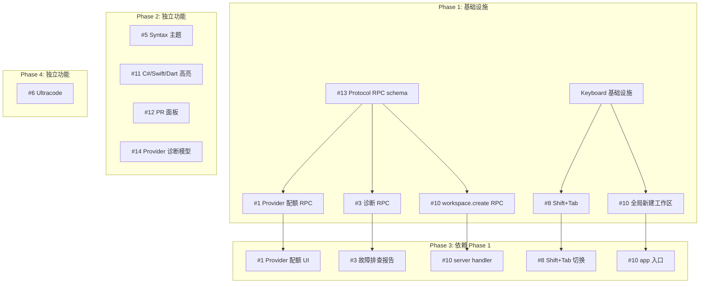

## ChisaCode ← Paseo 上游同步实施计划

> **基线**：ChisaCode v1.0.2，同步目标 Paseo HEAD `e63a971`（v0.1.102-beta.1）  
> **分析报告**：[paseo-upstream-diff-report-2026-06-30.md](./paseo-upstream-diff-report-2026-06-30.md)

---

### 决策汇总

| #   | 功能                    | 决策    | 理由                                              |
| --- | ----------------------- | ------- | ------------------------------------------------- |
| 1   | Provider 配额/用量      | ✅ 加入 | 选项卡切换，保留本地统计 + 新增 provider 配额视图 |
| 2   | Docker 镜像             | ❌ 跳过 | 暂不需要容器化部署                                |
| 3   | 故障排查报告一键复制    | ✅ 加入 | 高性价比，诊断片段已存在                          |
| 4   | ja/pt-BR i18n           | ❌ 跳过 | ChisaCode 定位聚焦 zh-CN                          |
| 5   | Syntax 主题系统（8套）  | ✅ 加入 | 提升代码块视觉效果                                |
| 6   | Ultracode（Claude）     | ✅ 加入 | Claude 用户需超深度推理                           |
| 7   | 自定义 Copilot agent    | ❌ 跳过 | 无 Copilot 用户                                   |
| 8   | Shift+Tab 模式切换      | ✅ 加入 | 高频交互提升，与 #10 共享键盘基础设施             |
| 9   | Claude 图片工具结果渲染 | ❌ 跳过 | 暂不迫切                                          |
| 10  | 全局新建工作区          | ✅ 加入 | UX 补强，与 #8 共享键盘基础设施                   |
| 11  | C#/Swift/Dart 语法高亮  | ✅ 加入 | 极小工作量（3 依赖 + 1 文件）                     |
| 12  | PR 面板完整实现         | ✅ 加入 | 完整 PR 详情、刷新按钮、CI checks                 |
| 13  | Protocol 级新 RPC       | ✅ 加入 | #1 #3 #10 的前置依赖                              |
| 14  | Provider 诊断模型       | 🔍 待定 | #3 的辅助层，视 #3 实现时是否需要                 |
| 15  | MiniMax provider 集成   | ❌ 跳过 | 暂无 MiniMax 用户                                 |

---

### 依赖关系图



---

### 分阶段实施计划

#### Phase 1：基础设施（前置条件）

##### 1-1. #13 Protocol 级 RPC Schema 补充

**文件**：`packages/protocol/src/messages.ts`

需要新增的 schema（按依赖追加上游定义）：

| 新增 RPC                                                            | 行数（估） | 用途                  | 下游依赖 |
| ------------------------------------------------------------------- | ---------- | --------------------- | -------- |
| `provider.usage.list.request/response`                              | ~50        | provider 配额数据拉取 | #1       |
| `diagnostics.request/response`                                      | ~30        | daemon 诊断报告拉取   | #3       |
| `workspace.create.request/response`                                 | ~30        | 全局新建工作区        | #10      |
| `ProviderUsageSchema`（含 windows/balances）                        | ~80        | 配额数据结构          | #1       |
| `COMPAT(providerUsageList)` client capability                       | ~5         | 功能门控              | #1       |
| `COMPAT(daemonDiagnostics)` client capability                       | ~5         | 功能门控              | #3       |
| 注册到 `ServerInboundMessageSchema` / `ServerOutboundMessageSchema` | ~10        | schema union          | 全部     |
| 导出新类型（`type ... = z.infer<...>`）                             | ~5         | TypeScript 类型       | 全部     |

**独立新增文件**：

- `packages/protocol/src/binary-frames/demux.ts` — 二进制帧解复用（可选，无即依赖）

**批量更新**：

- `packages/protocol/src/binary-frames/index.ts` — 导出 demux（如果有）
- `packages/protocol/src/index.ts` — 确保 demux 在 exports map 中

**工作量**：~1 天（约 200 行纯 schema 定义，不含业务逻辑）

---

##### 1-2. Keyboard 基础设施

**目标**：合入上游的 keyboard 体系，同时支撑 #8 和 #10。

**新增文件**（从上游引入，品牌化映射）：

| 文件                                             | 行数 | 作用                                                                                      |
| ------------------------------------------------ | ---- | ----------------------------------------------------------------------------------------- |
| `app/src/keyboard/keyboard-action-dispatcher.ts` | ~80  | 定义 `KeyboardActionId` 类型，含 `workspace.new`、`message-input-mode-cycle-shift-tab` 等 |
| `app/src/keyboard/keyboard-shortcuts.ts`         | ~950 | 键盘快捷键绑定表，含 `Shift+Tab`、`Ctrl+K N` 等                                           |
| `app/src/keyboard/keyboard-shortcuts.test.ts`    | ~200 | 快捷键绑定测试                                                                            |
| `app/src/hooks/use-keyboard-action-handler.ts`   | ~60  | 键盘动作路由 hook                                                                         |

**修改文件**：

- 所有品牌化标识符（paseo→chisacode）需在引入时映射
- `app/src/screens/settings/keyboard-shortcuts-screen.tsx`（如已存在则可能需更新）

**工作量**：~2 天（引入 + 品牌化 + 测试）

---

#### Phase 2：独立功能（可并行）

##### 2-a. #5 Syntax 主题系统

**文件**：

| 文件                                              | 操作                 | 行数 |
| ------------------------------------------------- | -------------------- | ---- |
| `packages/highlight/src/themes.ts`                | 新增                 | ~298 |
| `packages/highlight/src/__tests__/themes.test.ts` | 新增                 | ~100 |
| `packages/highlight/src/index.ts`                 | 修改（新增 exports） | +5   |

**依赖**：无

**风险**：

- 品牌化：颜色常量中可能有 paseo 引用？上游 themes.ts 内容为纯主题定义，通常无品牌引用
- highlight 包不同步主题后 `<HighlightedCodeBlock>` 组件是否会有 breakage？—— 不会，theme.ts 导出的是独立常量

**工作量**：极低（~1h，纯复制 + 依赖安装 + 测试）

---

##### 2-b. #11 C#/Swift/Dart 语法高亮

**文件**：

| 文件                                               | 操作                          | 行数 |
| -------------------------------------------------- | ----------------------------- | ---- |
| `packages/highlight/src/parsers.ts`                | 修改（新增 3 个 parser 注册） | +10  |
| `packages/highlight/src/__tests__/parsers.test.ts` | 修改（新增 3 个断言）         | +10  |
| `packages/highlight/package.json`                  | 修改（新增 3 个依赖）         | +3   |

**新增 npm 依赖**：

- `@replit/codemirror-lang-csharp: ^6.2.0`
- `@codemirror/language: ^6.12.3`
- `@codemirror/legacy-modes: ^6.5.3`

**工作量**：极低（~0.5h，纯配置 + 依赖安装）

---

##### 2-c. #12 PR 面板完整实现

**上游源码**：`app/src/git/pull-request-panel/`（21 个文件）

**ChisaCode 当前**：自研精简版 `pr-pane.tsx`（~5 个文件）

**策略**：不完全替换，而是**增量合入**上游的关键改进：

| 上游文件                               | 作用                          | 必要性 |
| -------------------------------------- | ----------------------------- | ------ |
| `pull-request-panel/pane.tsx`          | 面板主组件（含刷新按钮）      | 高     |
| `pull-request-panel/data.ts`           | 数据层（PR 数据查询）         | 高     |
| `pull-request-panel/activity-state.ts` | PR activity 状态              | 中     |
| `pull-request-panel/timeline.ts`       | PR 时间线                     | 中     |
| `pull-request-panel/use-data.ts`       | 数据 hook                     | 高     |
| `pull-request-panel/pr-hint.ts`        | PR 状态提示                   | 低     |
| 其余 15 个文件                         | checks/status/merge option 等 | 低     |

**建议**：先不全部替换。从上游提取以下能力融入到现有 `pr-pane.tsx`：

1. 显式刷新按钮 → 现有 `isRefreshing` 状态已有，补 UI 按钮
2. merge option 标注（squash/merge/rebase）→ 新增
3. CI checks 状态 → 新增

**工作量**：~3 天（需理解两边代码结构后融合）

---

##### 2-d. #14 Provider 诊断模型（待定）

**上游文件**：`app/src/components/provider-diagnostic-models.ts`

如果 #3（故障排查报告）需要此文件作为基础，则应在此阶段引入；否则可跳过。

**工作量**：~0.5 天

---

#### Phase 3：依赖 Phase 1 的功能

##### 3-a. #1 Provider 配额/用量（选项卡切换）

**依赖**：#13 `provider.usage.list.*` RPC schema

**server 端新增**：
| 文件 | 操作 | 行数 |
|------|------|------|
| `server/src/services/quota-fetcher/` 目录 | 新增 | — |
| `server/src/services/quota-fetcher/index.ts` | 新增 | ~60 |
| `server/src/services/quota-fetcher/types.ts` | 新增 | ~40 |
| `server/src/services/quota-fetcher/providers/claude.ts` | 新增 | ~80 |
| `server/src/services/quota-fetcher/providers/kimi.ts` | 新增（ChisaCode 特有） | ~80 |

**策略**：不上游 8 个全搬。只适配 ChisaCode 实际使用的 provider：

- Claude → 必须（上游已有 template）
- Kimi → 新增（ChisaCode 独有）
- 其余 6 个 → 不在第一期

**app 端修改**：
| 文件 | 操作 | 描述 |
|------|------|------|
| `screens/settings/usage-statistics-section.tsx` | 修改 | 添加 SegmentedControl 切换"本地用量 / Provider 配额"两个选项卡 |
| `provider-usage/` 目录 | 新增 | 从上游引入 provider-usage 组件目录 |

**选项卡切换设计**（不照搬上游独立页面）：

```tsx
<SegmentedControl
  options={[
    { value: "local", label: "本地用量" }, // 现有功能
    { value: "provider", label: "Provider 配额" }, // 新增
  ]}
/>;
{
  activeTab === "local" ? <现有功能 /> : <ProviderUsageView />;
}
```

**工作量**：~5 天（server 2 + app 3）

---

##### 3-b. #3 故障排查报告一键复制

**依赖**：#13 `diagnostics.request/response` RPC schema

**新增文件**：

| 文件                                           | 操作 | 描述                                             |
| ---------------------------------------------- | ---- | ------------------------------------------------ |
| `app/src/diagnostics/app-diagnostic-report.ts` | 新增 | 格式化诊断报告（`formatAppDiagnosticHeader` 等） |
| `app/src/components/app-diagnostic-sheet.tsx`  | 新增 | 诊断报告 UI + Clipboard 复制按钮                 |

**修改文件**：
| 文件 | 操作 | 描述 |
|------|------|------|
| `app/src/screens/settings-screen.tsx` | 修改 | 集成 AppDiagnosticSheet |
| `app/src/i18n/index.ts` | 修改 | 新增翻译 key（如 `troubleshooting.copy` 等） |

**现有基础**：

- `provider-diagnostic-sheet.tsx` ✅（已有 provider 诊断弹窗）
- `formatProviderDiagnosticReport` ✅（server 端格式化逻辑）
- host runtime state ✅（可获取 host 信息）

**新增能力**：

- 聚合 host + daemon + provider + 日志 四个信息源为一个可复制文本
- `Clipboard.setStringAsync` 一键复制

**工作量**：~2 天（app 2 文件新增 + 1 文件修改 + i18n）

---

##### 3-c. #8 Shift+Tab 模式切换

**依赖**：#1→#Phase1 的 Keyboard 基础设施

**修改文件**：

| 文件                                               | 操作     | 描述                                                           |
| -------------------------------------------------- | -------- | -------------------------------------------------------------- |
| `app/src/keyboard/keyboard-shortcuts.ts`           | 新增条目 | `id: 'message-input-mode-cycle-shift-tab', combo: 'Shift+Tab'` |
| `app/src/keyboard/keyboard-shortcuts.test.ts`      | 新增测试 | `'routes Shift+Tab to cycle agent mode'` 等                    |
| `app/src/composer/agent-controls/mode-control.tsx` | 修改     | 对接 keyboard action，处理模式循环                             |

**键盘绑定映射**（已随 Phase 1 引入 keyboard-shortcuts.ts）：

```typescript
{
  id: "message-input-mode-cycle-shift-tab",
  label: "settings.keyboard.messageInputModeCycleShiftTab",
  combo: "Shift+Tab",
  allowedWhere: "composer",
}
```

**工作量**：~1 天（基础设施已就位，仅需配置 + 对接模式控制）

---

##### 3-d. #10 全局新建工作区

**依赖**：#13 `workspace.create.*` RPC + Keyboard 基础设施

**新增文件**：

| 文件                                                             | 操作 | 描述                                                       |
| ---------------------------------------------------------------- | ---- | ---------------------------------------------------------- |
| `app/src/hooks/use-global-new-workspace-action.ts`               | 新增 | 全局 `workspace.new` 动作 handler                          |
| `app/src/hooks/use-clear-workspace-attention.ts`                 | 新增 | 清除旧工作区焦点（可选）                                   |
| `app/src/hooks/use-file-picker.ts`                               | 新增 | web 平台文件选择器适配                                     |
| `server/src/server/session-handlers/workspace-create-handler.ts` | 新增 | server 端 handler（放在 session-handlers 而非 session.ts） |

**修改文件**：

| 文件                                          | 操作              | 描述                               |
| --------------------------------------------- | ----------------- | ---------------------------------- |
| `app/src/keyboard/keyboard-shortcuts.ts`      | 新增条目          | `workspace.new` 快捷键 `Ctrl+K N`  |
| `app/src/screens/new-workspace-screen.tsx`    | 修改              | 支持无 project 上下文的全局调用    |
| `app/src/components/left-sidebar.tsx`         | 修改              | 添加 "+" 新建工作区按钮            |
| `app/src/app/new.tsx`                         | 修改              | 路由注册（上游 layout 改动）       |
| `app/src/app/_layout.tsx`                     | 修改              | 注册 `useGlobalNewWorkspaceAction` |
| `server/src/server/session-handlers/index.ts` | 修改              | 注册新 handler                     |
| `packages/protocol/src/messages.ts`           | 已由 Phase 1 完成 | schema 已就位                      |

**server handler 设计**（session-handlers 架构）：

```typescript
export function handleWorkspaceCreateRequest(
  ctx: SessionContext,
  request: WorkspaceCreateRequest,
): Promise<WorkspaceCreateResponse> {
  if (request.source.kind === "directory") {
    return handleLocal(ctx, request);
  }
  return handleWorktree(ctx, request);
}
```

**工作量**：~5 天（app 4 天 + server 1 天）

---

#### Phase 4：独立功能

##### 4-a. #6 Ultracode（Claude 超深度推理）

**上游文件**：`packages/server/src/server/agent/providers/claude/agent.ts`

**新增逻辑**：

```typescript
type ClaudeThinkingOption = ClaudeThinkingEffort | "ultracode";

function resolveThinkingConfig(option?: ClaudeThinkingOption) {
  if (option === "ultracode") {
    return { type: "enabled", budgetTokens: 32000 };
  }
  // ... existing logic
}
```

**修改文件**：

| 文件                                                     | 操作 | 描述                                                       |
| -------------------------------------------------------- | ---- | ---------------------------------------------------------- |
| `server/src/server/agent/providers/claude/agent.ts`      | 修改 | 新增 `ultracode` thinking option + `resolveThinkingConfig` |
| `server/src/server/agent/providers/claude/models.ts`     | 修改 | 在支持的模型上暴露 `ultracode` 选项                        |
| `server/src/server/agent/providers/claude/agent.test.ts` | 修改 | 新增测试用例                                               |

**ChisaCode 特有考虑**：

- ChisaCode Claude agent 与上游可能存在品牌化差异，合入时需逐行比对 claude/agent.ts 的 diff
- Ultracode 是 Claude 的 API 原生能力（thinking.budgetTokens=32000），不是 paseo 的自研功能

**工作量**：~2 天（主要时间花在解 ChisaCode claude agent 与上游的 diff）

---

### 全部工作量汇总

| 阶段    | 项目                      | 估时   | 可并行？                              |
| ------- | ------------------------- | ------ | ------------------------------------- |
| Phase 1 | #13 Protocol RPC schema   | 1 天   | ❌                                    |
| Phase 1 | Keyboard 基础设施         | 2 天   | ❌（可与 #13 并行）                   |
| Phase 2 | #5 Syntax 主题            | 0.5 天 | ✅                                    |
| Phase 2 | #11 C#/Swift/Dart 高亮    | 0.5 天 | ✅                                    |
| Phase 2 | #12 PR 面板               | 3 天   | ✅                                    |
| Phase 2 | #14 Provider 诊断（待定） | 0.5 天 | ✅                                    |
| Phase 3 | #1 Provider 配额          | 5 天   | ❌（依赖 Phase 1 + 可选 Phase 2 #14） |
| Phase 3 | #3 故障排查报告           | 2 天   | ✅（依赖 Phase 1）                    |
| Phase 3 | #8 Shift+Tab              | 1 天   | ✅（依赖 Phase 1 Keyboard）           |
| Phase 3 | #10 全局工作区            | 5 天   | ✅（依赖 Phase 1 #13 + Keyboard）     |
| Phase 4 | #6 Ultracode              | 2 天   | ✅（无依赖）                          |

|                      |          |
| -------------------- | -------- |
| **串行总计**         | ~22 天   |
| **理想并行**（3 人） | ~8-10 天 |

---

### 品牌化注意事项

所有从上游引入的文件必须做品牌化映射：

- `paseo` → `chisacode`
- `Paseo` → `ChisaCode`
- `@getpaseo/*` → `@chisacode/*`
- `paseo.json` → `chisacode.json`
- `paseo:*` IPC → `chisacode:*` IPC
- Logo / icon 引用
- CLI 命令名称

### 风险

1. **session.ts vs session-handlers**：ChisaCode 已拆分 session-handlers，上游 workspace.create handler 在 session.ts 中。合入时需放在 `server/src/server/session-handlers/` 而非 session.ts，避免 merge hell
2. **protocol exports map**：上游 `packages/protocol/package.json` exports 需手动同步，新增条目必须加到 exports map
3. **i18n key 冲突**：上游新增 UI 组件引用的 i18n key 可能在 ChisaCode 单文件 index.ts 中不存在，需手动补充翻译
4. **npm 依赖**：#11 新增 3 个包依赖，需跑 `npm ci` 验证
5. **测试覆盖**：每个 Phase 完成后必须跑对应包的测试（`npx vitest run <path> --bail=1`）

### 测试策略

| 包        | 测试命令                                             | 关注点                                     |
| --------- | ---------------------------------------------------- | ------------------------------------------ |
| protocol  | `npx vitest run packages/protocol --bail=1`          | schema 正确性、类型窄化                    |
| highlight | `npx vitest run packages/highlight --bail=1`         | 新 parser/theme 注册                       |
| server    | `npx vitest run packages/server/src/server --bail=1` | handler 功能、RPC 往返                     |
| app       | 仅跑相关测试文件                                     | keyboard-shortcuts、pr-pane、new-workspace |
